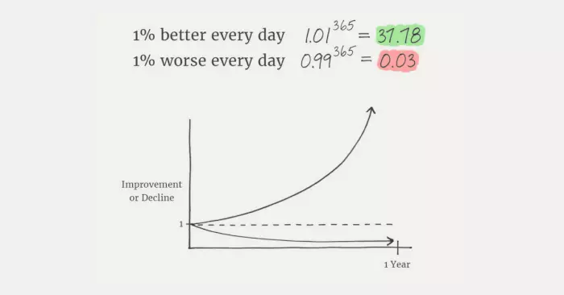
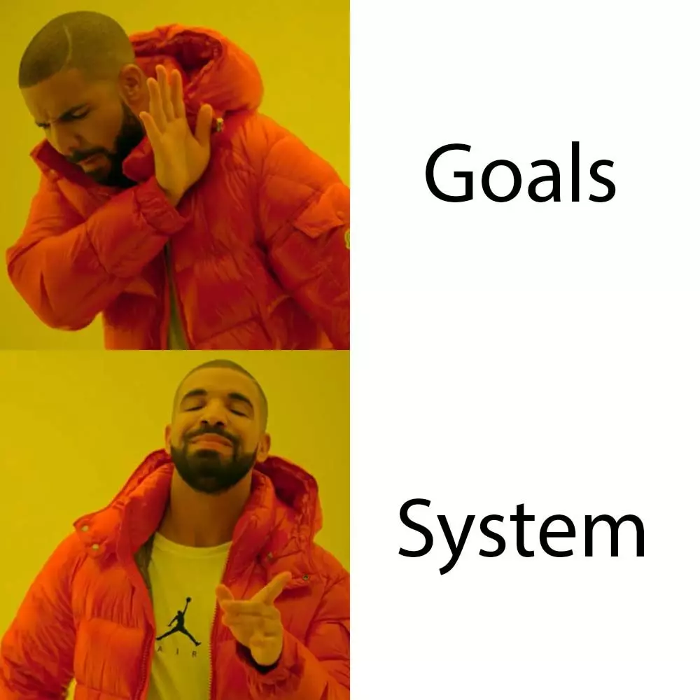
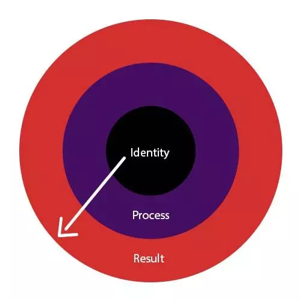
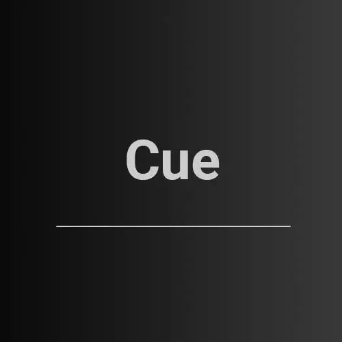
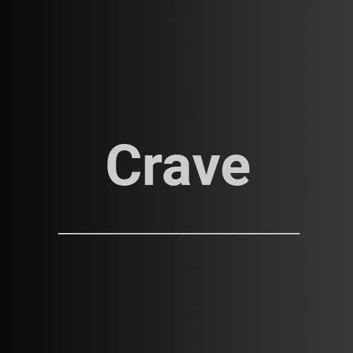

+++
date = '2021-05-07T15:22:51+03:30'
draft = false
title = 'عادت‌های اتمی - تغییرات کوچک، نتایج بزرگ'
description = 'مطالب و درس‌های مهمی که می‌توان از کتاب عادت‌های اتمی برداشت کرد'
keywords = ['عادت‌های اتمی', 'جیمز کلیر', 'تغییرات کوچک', 'نتایج بزرگ', 'مدیریت زمان', 'بهره‌وری', 'ساختن عادت', 'کتاب‌های انگیزشی', 'توسعه فردی', 'قانون یک درصد']
categories = ['book', 'personal-growth', 'lifestyle', 'productivity', 'science']
tags = ['time-management', 'productivity', 'self-help']
image = 'atomic-habits.webp'
+++

کتاب عادت‌های اتمی (به انگلیسی Atomic Habits) نوشته جیمز کلیر در سال ۲۰۱۸ وارد بازار شد و بسیار مورد توجه قرار گرفت. ایده اصلی این کتاب ساختن عادت‌های کوچیکی هست که باعث دست‌یافتن نتایج بزرگ میشن.

کتاب ابتدا به اهمیت عادت‌ها و تاثیری که بر روی زندگی ما دارن می‌پردازه، و بعد از اینکه خواننده رو متقاعد کرد چقدر عادت‌های کوچیک مهم و تاثیرگذار هستن، به طور اصولی راه‌هایی ارائه میده تا عادت‌های خوبی بسازیم و از عادت‌های بدمون دوری کنیم.
# قسمت اول – چرا عادت‌های اتمی مهم‌اند؟
شاید براتون سوال پیش اومده باشه که چرا عادت‌های اتمی؟ معنی این ترکیب چی هست؟ منظور نویسنده کتاب از عادت‌های اتمی، عادت‌های کوچیکی هستن که در کنار هم رفتار ما رو شکل میدن. درست مانند اتم‌ها که ذرات بسیار ریزی هستن که جهان رو میسازن.
## قانون یک درصد
اکثر مردم به کارهای بزرگ اعتقاد دارن. به نظر اون‌ها هرکسی که موفق شده کار خیلی بزرگی انجام داده. معمولا هم کارهای مفید کوچیک دست کم گرفته میشن. کتاب میگه مثل اکثر مردم نباشید!

قانون یک درصد بیان می‌کنه هر روز یک درصد بهتر از دیروز بشیم. این کار باعث میشه در نهایت وقتی به عقب نگاه کنیم متوجه پیشرفت عجیب و غریبمون بشیم. اگه از دید ریاضی به قضیه نگاه کنیم هم قضیه خیلی جالب میشه!

برخلاف انتظارات، نتایجی که به‌دست میاریم به شکل خطی نیستن. مدت زمان زیادی طول می‌کشه تا نتیجه کارمون مشخص بشه و همین موضوع باعث میشه وسط فرایند ناامید بشیم و از ادامه دادن دست بکشیم.
## دور انداختن اهداف
همیشه بهمون گفته شده باید برای آینده هدف داشته باشیم و برای هدفمون بجنگیم. کتاب میگه هرچی هدف برای خودتون مشخص کردین بریزین دور! دلایلی هم برای این حرفش میاره که شما رو متقاعد کنه.

اولاً برنده‌ها و بازنده‌ها یک هدف مشترک دارن، پس کسی که هدف داشته باشه و براش تلاش کنه لزوماً به هدفش نمی‌رسه.

دوماً اگه کارهایی که ما انجام می‌دیم فقط به خاطر رسیدن به اهداف باشن، قبل از رسیدن به هدف از کاری که انجام می‌دیم لذت نمی‌بریم و چون معمولاً نتایج دیر مشخص میشن، قبل از پایان کار از ادامه دادن منصرف میشیم.

سوماً بعد از رسیدن به هدف، به طور موقت خوشحال میشیم و بعدش معمولاً دست از اون کار می‌کشیم. فردی که برای به‌دست آوردن شکمی شیش تیکه به باشگاه میره، بعد از اینکه به این مهم رسید، راضی و خشنود میشه و دیگه ادامه نمیده. در نهایت همین دست‌آوردش هم از بین میره.

کتاب یک راه جایگزین برای هدف به ما پیشنهاد میده. به جای تلاش برای رسیدن به هدف، سیستم فعالیت‌هامون رو درست کنیم. اگه کسی توی ۹۰ دقیقه بازی فوتبال به تابلو امتیازات نگاه کنه هیچ فایده‌ای نداره، باید روی سیستم بازی کردنش تمرکز کنه. با این کار برنده شدن هم خود به خود به‌دست میاد.
## تغییر هویت
این قسمت از کتاب شاید مهم‌ترین و تاثیرگذارترین بخشش باشه. در ادامه بخش قبلی، کتاب میگه شما باید هویت خودتون رو تغییر بدین. کاری به نتیجه نداشته باشین. ورزش نکنین به خاطر این‌که به شکمی شیش تیکه برسین، ورزش کنین چون خودتونو آدمی ورزش‌کار می‌دونین و از این کار لذت می‌برین.

فرض کنین اتاق‌تون کثیف و نامرتب شده. هدفی برای خودتون مشخص می‌کنین که اتاق رو مرتب نگه دارین. این‌جوری هر موقع که اتاق کثیف میشه باید برین و اتاق رو تمیز کنین. این کار به شدت سخت و خسته کنندس و شما نهایتاً بعد چند بار انجام این کار دیگه ادامه نمی‌دین.

این دیدگاه بر اساس نتایج هست. از بیرون داریم به قضیه نگاه می‌کنیم. بهتر و اصولی‌تر اینه که از درون به بیرون نگاه کنیم. اصلا چرا اتاق کثیف و نامرتب میشه؟ اگه من تبدیل به آدمی بشم که اتاق رو کثیف نکنه، دیگه اصلا نیازی به تمیز کردن نیست.

یک نقل و قولی هست که میگه:

> برای این‌که به موفقیت برسی، اول باید آدم موفقی باشی.

به شخصه این قسمت از کتاب رو خیلی دوست داشتم و تاثیر زیادی روی کارهایی که انجام میدم داشته. همین که اومدم و اینجا دارم می‌نویسم نتیجه همین دیدگاه بوده.
# قسمت دوم – چطور عادت‌های خوبی بسازیم؟

حالا که قانع شدیم عادت‌های کوچیک باعث تغییرات بزرگ میشن، نوبت اینه که ببینیم چطوری باید عادت‌های خوب در خودمون ایجاد کنیم. کتاب ۴ قانون برای تغییر رفتار ارائه میده که در این چهار عبارت خلاصه میشن: «نشانه، اشتیاق، پاسخ، پاداش»
## ۱- نشانه

اولین عاملی که باعث انجام یک عمل میشه، نشونه هست. نشونه یک سیگنالی هست به مغز که باعث میشه به انجام اون کار فکر کنه. مثل وقتی از کنار بستنی‌فروشی رد می‌شین و با دیدن بستنی اقدام به خریدنش می‌کنین. ولی آیا قبل از دیدن بستنی واقعا می‌خواستین بستنی بخورین؟

برای این‌که عادت‌های خوب ایجاد کنیم، اول باید نشونه‌های اون عادت رو جلوی چشم‌مون قرار بدیم. اگه برای مثال می‌خواین گیتار زدن رو یاد بگیرین، بذارینش توی اتاق خوابتون یا جایی که بیشتر وقت رو اونجا می‌گذرونین.

برعکس، برای اینکه عادت‌های بد رو رها کنین، نشونه‌های اون رو از جلوی چشم‌تون بردارین. اگه نمی‌خواین خیلی درگیر فضای مجازی بشین، موبایل‌تون رو بذارین یه اتاق دیگه تا حواس‌تون رو پرت نکنه.

تنظیم کردن محیطی که توش هستین، شما رو به سمت انجام کارهای خوب هُل میده.
## ۲- اشتیاق

عامل بعدی اشتیاق و هوس‌کردنه. بعد از مواجه‌شدن با نشونه، مغز «می‌خواد» که اون کار رو انجام بده. این مرحله همون‌جاییه که انگیزه وارد کار میشه. کسی که انگیزه بالایی داره واقعا و از ته دلش می‌خواد که اون کار رو انجام بده.

> حتما متوجه شدین که انگیزه تنها قسمتی از پروسه انجام کاره. تکیه کردن به انگیزه اصلا کار درستی نیست و هیچ‌وقت جواب نمیده. برای موفق‌شدن به چیزی بیشتر از انگیزه نیاز دارین.

کتاب عنوان می‌کنه که عادت‌های خوب رو تا جایی که می‌تونین جذاب کنین. جذاب‌کردن کارهای خوب (که معمولاً اصلاً جذاب نیستن)‌ کار خیلی سختیه. اما راه‌حل‌هایی وجود داره.

اگه می‌خواین پیاده‌روی کنین، یک کفش نو بخرین. اگه باشگاه حوصلتون رو سر می‌بره، همیشه بعد از باشگاه برین استخر. اگه درس‌خوندن کار سختیه، با خودتون قرار بذارین بعد از انجامش یه غذایی که دوس دارین بخورین. کافیه به این فکر کنین که برای جذاب کردن چه کارهایی میشه انجام داد.
## ۳- پاسخ

پاسخ در واقع همون انجام دادن هست. مرحله‌ای که وارد میدون می‌شیم و شروع می‌کنیم به انجام کار.

دو تا مشکل بزرگ در این مرحله وجود داره، مورد اول زمانی اتفاق میفته که کاری رو انجام نمیدیم و تنبلی می‌کنیم؛ مورد بعدی انجام دادن بیش از حد یه کاریه. اگه کاری رو بیشتر از توانمون انجام بدیم، حتی اگه کاری باشه که دوستش داریم، معمولا خسته میشیم و باز هم ادامه نمیدیم.

کتاب میگه هرچی میتونین کارها رو آسون کنین. انقدر آسون کنین که دیگه شبیه مسخره‌بازی بشه. قانون ۲ دقیقه رو معرفی می‌کنه که بیان می‌کنه اگه می‌خواین کاری رو شروع کنین، با ۲ دقیقه انجام اون کار شروع کنین و یواش‌یواش بیشترش کنین. اگه می‌خواین پیاده‌روی کنین ولی به قول معروف حسش رو ندارین، ۲ دقیقه پیاده‌روی کنین، ۲ دقیقه که واقعا چیزی نیست!

مقاومت از انجام کار، خیلی نیروی بزرگیه. مهم اینه که فقط شروع کنین. بعد از شروع کار، دیگه اون مقاومت اولیه وجود نداره و خیلی خیلی راحت‌تر میشه ادامه داد. پس اگه به این مقاومت دچار شدین، با خودتون قرار بذارین که به مدت ۲ دقیقه اون کار رو انجام بدین و اگه خوشتون نیومد دیگه ادامه ندین. این تکنیک با این‌که خیلی ساده به نظر میاد ولی به طرز عجیبی کار می‌کنه.
## ۴- پاداش

مواردی که تا الان بررسی شدن، باعث می‌شدن که کاری انجام بشه. این مورد باعث میشه کاری تکرار بشه. عامل اصلی برای اینکه یک کاری رو تکرار کنین، پاداشه. هیچ‌کس محض رضای خدا موش نمی‌گیره، بالاخره یه چیزی تهش باید نسیب‌مون بشه تا راضی به انجام دوباره اون کار بشیم.

کتاب میگه جدای از این‌که پاداش مهمه، خیلی مهمه که بلافاصله باشه. مغز توانایی درک پاداش‌های در درازمدت رو نداره. با درس‌خوندن نمره خیلی خوبی می‌گیریم، ولی مغز این حرف‌ها حالیش نمیشه.

یک سیستم جایزه‌دهی برای کارهای خوبتون در نظر بگیرین و در مقابل برای کارهای بد تنبیه در نظر بگیرین. این مرحله خیلی مهمه و معمولا افراد از این مرحله غافل می‌مونن. انجام یک کار به طور مداوم و طولانی‌مدت بدون پاداش ممکن نیست.

کتاب در ادامه توصیه‌هایی رو به انتهای کتاب پیوست می‌کنه که به نظرم می‌تونه دلیل خوبی باشه برای اینکه شما برین و خودتون کتاب رو بخونین.
# سخن پایانی
ممکنه با همه قسمت‌های کتاب موفق نباشین، ولی موارد خیلی مهمی توی این کتاب هست، به همراه مثال‌های واقعی که کمک خیلی زیادی در شکل‌گیری عادت‌هاتون داره. توصیه اکید می‌کنم حتماً این کتاب رو به طور کامل بخونین. این کتاب به فارسی هم ترجمه شده و می‌تونین نسخه فارسیش رو تهیه کنین.