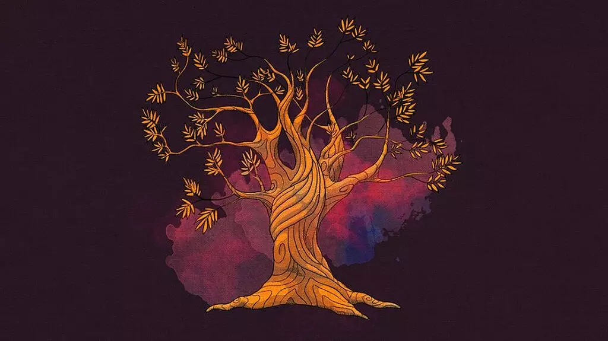

+++
date = '2021-06-25T18:25:12+03:30'
draft = true
title = 'سردرگمی'
description = 'در این نوشته از سردرگمی های ذهنی و فلسفی ام می گویم و سوالاتی که در این راه برایم پیش آمده اند. آیا باورهایمان درست اند؟'
categories = ['philosophy']
keywords = ['سردرگمی', 'فلسفه', 'باورها', 'زندگی روزمره', 'کتاب‌خوانی', 'کرونا', 'تفکر انتقادی', 'معرفت‌شناسی', 'شک‌گرایی', 'فلسفه زندگی', 'mental confusion', 'philosophy', 'beliefs', 'daily life', 'reading books', 'COVID-19', 'critical thinking', 'epistemology', 'skepticism', 'philosophy of life']
tags = ['سردرگمی', 'فلسفه', 'باورها', 'زندگی روزمره', 'کتاب‌خوانی', 'کرونا', 'تفکر انتقادی', 'معرفت‌شناسی', 'شک‌گرایی', 'فلسفه زندگی', 'mental confusion', 'philosophy', 'beliefs', 'daily life', 'reading books', 'COVID-19', 'critical thinking', 'epistemology', 'skepticism', 'philosophy of life']
image = 'banner.webp'
+++

مدتی است که سردرگم شده‌ام. سوالاتی در ذهنم شکل گرفته‌اند که نمی‌توانم به آن‌ها پاسخ دهم. چکار باید کرد؟ چگونه از این سردرگمی در بیایم؟

چند وقتی است که دیگر خود را موظف به خواندن کتاب‌های درسی نمی‌دانم. بعد از اتمام مدرسه، آن سال کذایی منتهی به کنکور و تقریبا ۶ ماه تحصیل در دانشگاه، با آمدن کرونا فرصتی فراهم شد تا دنبال مطالبی بروم که خودم انتخاب می‌کنم، نه نسخه‌ای که برای تمامی دانش‌آموزان و دانشجویان پیچیده‌اند.

دوران تغییر من شروع شد. از همان اولین لحظه‌ای که دست از خواندن کتاب‌هایی که اشتیاق به خواندنشان نداشتم کشیدم. داستانی که همچنان ادامه دارد.

با کتاب‌خوانی آشنا شدم. اوایل کتاب‌هایی برایم جذاب بودند که مربوط به حوزه تحصیلم بودند و به مراتب ارتباط بهتری با آنها می‌گرفتم. اما با گذشت زمان، کتاب‌هایی را در موضوعات مختلف توانستم برای خواندن انتخاب کنم.

در بین مطالبی که خواندم به این مطلب رسیدم که بیان می‌کرد بسیاری از کارهایی که انجام می‌دهیم و باورهایی که داریم، نتیجه تفکر و اختیار خودمان نیست. خیلی از کارها و باورهایمان به خاطر سنت‌ها، افکار و طرز برخورد دیگران و به طور کلی، محیطی است که در آن زندگی می‌کنیم.

این موضوع برای مدتی من را تحت تاثیر خودش قرار داده بود. تمام باورهایم زیر سوال رفته بود. مجبور شدم تمام آن‌ها را راستی آزمایی کنم. تکلیف تعدادی از آن‌ها هنوز هم مشخص نشده است.

گذشت و دوباره به مطلبی رسیدم که می‌گفت، معمول یک زندگی روزانه، انجام دادن کارهای روزمره است و بس. یعنی اگر کارهای روزمره را انجام دهیم، آن روز معمولی است. چیزی که بیشتر از همه از آن نفرت داشتم روزمرگی بود و با نگاه کردن به زندگی خودم، متوجه شدم که گرفتار این پدیده شدم.

همین باعث شد تا مدتی دوباره سردرگم شوم. چرا کاری را انجام می‌دهم که بیشتر از همه از آن نفرت دارم؟ اختیار چیزی بود که باز هم به وجودش شک کردم.

و در نهایت امروز، با خواندن مطلبی با موضوع معرفی فلسفه، به کلی دگرگون شدم. فلسفه، دقیقا همان چیزی بود که من به دنبالش بودم. موضوع مورد بحث در فلسفه این بود که چه چیزی درست است؟ چرا آن چیز درست است؟ و اگر درست است چگونه از آن در زندگی استفاده کنم؟

واقعا چه چیزی درست است؟ چگونه می‌توان فهمید چیزی که به آن باور داریم درست است؟ همان طور که همه باور داشتند که زمین تخت است ولی خلافش ثابت شد، ممکن است تمام چیزهایی که باور دارم اشتباه باشند!

در قسمتی از این مقاله آمده بود:

> درک ما از درختی که از درون اتاقمان می‌بینیم چیست؟ یک تصویری که گویا در فاصله دوری از ما قرار گرفته است. حال اگر آن‌قدر به آن نزدیک شویم که بتوانیم آن را لمس کنیم، اطلاعات بیشتری از آن به‌دست می‌آوریم. اما با این حال، باز هم تمام درک و شناختی که از آن درخت داریم، نتیجه سیگنال‌های عصبی است که از حسگرهایمان ارسال شده است. هرچقدر هم که به درخت نزدیک شویم، نمی‌توانیم آن را کامل بشناسیم و “درخت بودن” را تجربه کنیم.

حتی از درک کامل درخت هم عاجزیم! با خواندن این تکه از مقاله، همه‌چی برایم بی‌معنی شد. تصاویری که می‌بینم، صداهایی که می‌شنوم، سطوحی که لمس می‌کنم و طعمی که می‌چشم، همه و همه ساخته ذهن من هستند برای شناخت محیط بیرون و واکنش به آن. تمام این‌ها درون ذهن من در حال اتفاق افتادن هستند. پس بیرون چه خبر است؟؟؟

لازم نیست بگویم که این موضوع دوباره من را در حالی قرار داد که از زمان فراگیری کرونا چندین بار تکرار شده است. بارها و بارها و به بهانه‌های مختلف، مسائلی روبه‌رویم قرار می‌گیرند که مرا به فکر فرو می‌برند بدون آن که پاسخی برای آنها داشته باشم. به راستی که هرچه می‌گذرد، بیشتر به این موضوع پی می‌برم که هیچ چیز نمی‌دانم.

نظر شما چیست؟ آیا زیر سوال بردن چیزهایی که به آن‌ها اعتقاد داریم درست است؟ چگونه از این حالت خارج شوم؟ پیشنهاد شما برای یافتن پاسخ سوال‌هایم چیست؟