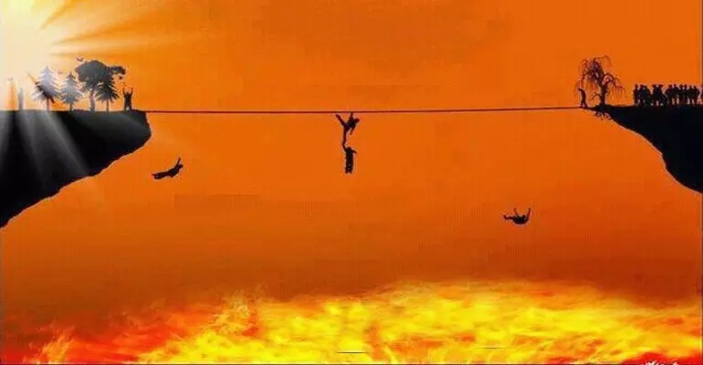

+++
date = '2021-07-16T14:05:19+03:30'
draft = false
title = 'بهشت و جهنم، حقیقتی برای ترساندن مردم'
description = 'بررسی مفهوم بهشت و جهنم و نقش عشق به خدا به جای ترس.'
categories = ['philosophy']
keywords = ['بهشت', 'جهنم', 'ترس', 'عشق به خدا', 'پل صراط', 'مفهوم بهشت و جهنم', 'ملت عشق', 'بهشت و جهنم در اسلام', 'بهشت و جهنم در ادیان', 'Heaven', 'Hell', 'Fear', 'Love of God', 'Serat Bridge', 'Concept of Heaven and Hell', 'The Forty Rules of Love', 'Heaven and Hell in Islam', 'Heaven and Hell in Religions']
tags = ['بهشت', 'جهنم', 'ترس', 'عشق به خدا', 'پل صراط', 'مفهوم بهشت و جهنم', 'ملت عشق', 'بهشت و جهنم در اسلام', 'بهشت و جهنم در ادیان', 'Heaven', 'Hell', 'Fear', 'Love of God', 'Serat Bridge', 'Concept of Heaven and Hell', 'The Forty Rules of Love', 'Heaven and Hell in Islam', 'Heaven and Hell in Religions']
image = 'banner.webp'
+++

با شنیدن بهشت و جهنم به یاد چه می‌افتیم؟ بهشت ما را یاد مکانی می‌اندازد که پر از میوه‌های خوشمزه و شراب ناب و رودی از شیر و عسل و حوریان بهشتی است. جهنم هم آتشی دارد سوزان و دردناک. این خلاصه درک و دریافت بسیاری از بهشت و جهنم است.

کمی غیر منطقی نیست که همه آنچه که در این دنیا حرام اعلام شده، در آن دنیا به شکل لذت بر ما حلال شود؟ چگونه است که در آن دنیا شراب خوردن مانعی ندارد؟ اصل قضیه که تفاوتی نکرده است.

متعصبان ادیان مختلف، سعی دارند با ترسیم بهشت و جهنم به این شکل، ترس را در وجود ما بکارند. افراد زیادی، برای رفتن به بهشت و نرفتن به جهنم دست به انجام کارهای خوب می‌زنند. شاید در ظاهر کار خوبی به نظر بیاید، ولی ما را از حقیقت ماجرا دور می‌کند.

حقیقت ماجرا این است که باید عشق به خدا را در دلمان قرار دهیم. کارهای خوبی که انجام می‌دهیم نه برای رفتن به بهشت، بلکه به خاطر این باشد که خداوند را دوست داریم و برای نزدیک‌تر شدن به او این کارها را انجام می‌دهیم.

حتما با پل صراط آشنایی دارید. پلی بسیار نازک که تنها افراد با تقوا توان عبور از آن را دارند و گناه‌کاران نمی‌توانند از آن گذر کنند و به اعماق جهنم میفتند. اینجا هم به نوعی از عنصر ترس استفاده شده است.

قضیه بهشت و جهنم، مانند گروکشی می‌ماند، چیزی مانند معامله با خدا. اگر کار خوبی انجام دهی بهشت را به تو می‌دهیم و اگر کار بدی انجام دهی تو را به جهنم می‌بریم تا مجازات شوی.

پس بهشت و جهنم واقعی چیست؟

> جهنم و بهشت همین جاست. دست از ترس از جهنم و رویابافی درباره بهشت بردار؛ چرا که بهشت و جهنم در هر لحظه زندگی ماست. هربار که عاشق می‌شویم، به بهشت صعود می‌کنیم و هربار که متنفر می‌شویم یا حسادت می‌ورزیم یا با کسی به جنگ می‌رویم، به قعر جهنم می رویم.

خدا را به خاطر خدا بودنش دوست بدار و کار خوب انجام بده چرا که فرد درستکاری هستی و برای کار خوب ارزش قائلی. بهشت و جهنم باید وسیله‌ای باشند برای رسیدن به هدف که خدا باشد، نه اینکه خودشان تبدیل به هدف شوند.

مطالب این نوشته برگرفته از کتاب ملت عشق بوده است. نظر شما در این باره چیست؟