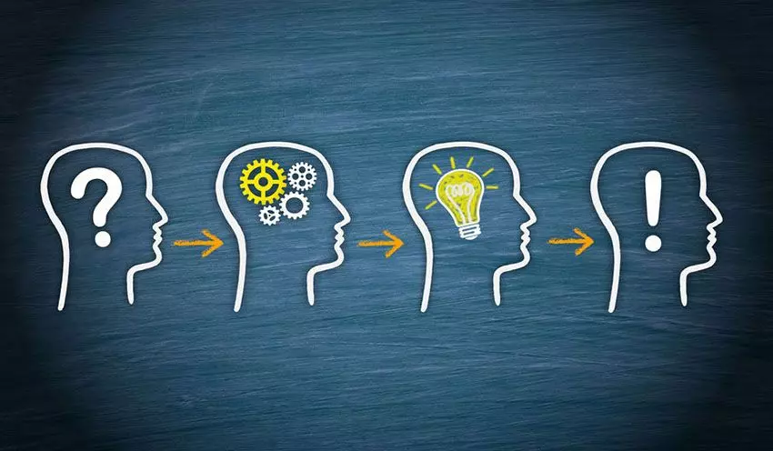
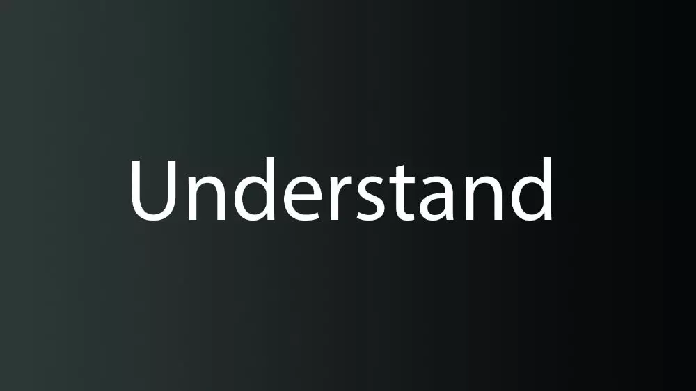
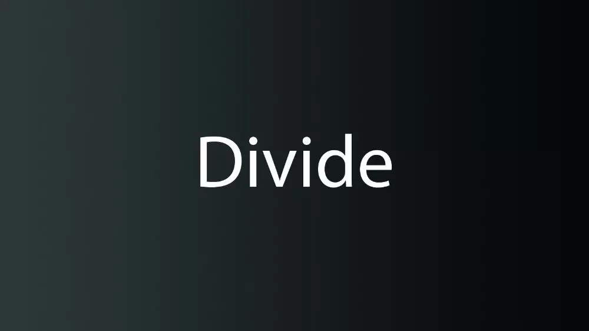
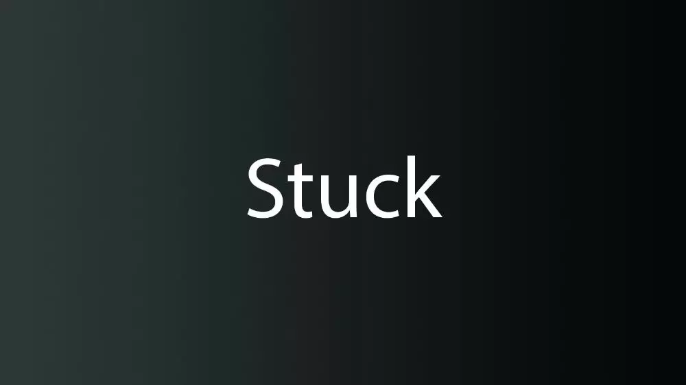

+++
date = '2021-08-27'
draft = false
title = 'چجوری مثل یه برنامه نویس فکر کنیم؟'
description = 'در این نوشته یاد می گیرید چطور مسائل را به روش های کاربردی و مؤثر حل کنید. با چارچوب های حل مسئله آشنا شوید و مهارت های خود را تقویت کنید.'
categories = ['tutorial', 'technology']
keywords = ['حل مسئله', 'تفکر برنامه‌نویسی', 'آموزش برنامه‌نویسی', 'مهارت‌های برنامه‌نویسی', 'problem solving', 'programmer mindset', 'programming tutorial', 'coding skills']
tags = ['حل مسئله', 'تفکر برنامه‌نویسی', 'آموزش برنامه‌نویسی', 'مهارت‌های برنامه‌نویسی', 'problem solving', 'programmer mindset', 'programming tutorial', 'coding skills']
math = true
image = 'banner.webp'
+++

این نوشته ترجمه‌ای از مطلبی با همین عنوان از سایت [freecodecamp](https://www.freecodecamp.org/news/how-to-think-like-a-programmer-lessons-in-problem-solving-d1d8bf1de7d2/) است.

اگه با برنامه‌نویسی آشنا باشی، حتما این حرف رو شنیدی:

> «همه باید برنامه‌نویسی رو یاد بگیرن، چون به شما نشون میده چطور فکر کنین.» - استیو جابز

احتمالا براتون سواله که منظور استیو از این حرفش چیه؟ یعنی چی که مثل برنامه‌نویس فکر کنیم؟ در اصل، مسئله درباره پیدا کردن راهی کاربردی برای حل مسئله هست. هدف از این پست اینه که دقیقا این راه رو بهتون نشون بدم. در اخر این پست می‌دونین که چطور یه مسئله رو به شکل یک برنامه‌نویس واقعی حل کنین.

# چرا مهمه اصلا؟

مهارت حل مسئله مهارت خیلی مهمیه. همه ما با مسئله‌های زیادی در زندگیمون مواجه میشیم. مسائل بزرگ و کوچیک مختلفی که کاملا رندوم هستن.

ما معمولا از این روش برای حل مسائل استفاده می‌کنیم (مگه اینکه یه سیستم خاصی برای خودمون داشته باشیم):

1. یه راه حلی رو امتحان می‌کنیم
2. اگه کار نکرد یه راه حل دیگه رو امتحان می‌کنیم
3. اگه بازم جواب نداد انقدر مرحله ۲ رو تکرار می‌کنیم تا به جواب برسیم

بعضی وقتا شانسمون می‌گیره و به جواب می‌رسیم، ولی این بدترین راهبرد برای حل مسائله! و واقعا وقت زیادی رو تلف می‌کنه. بهترین روش داشتن یه چارچوب مشخص و تمرین کردنه.

> تقریبا همهٔ کارفرماها اولویت اول رو به مهارت حل مسئله میدن. حتی بیشتر از تسلط به سینتکس و دیباگ کردن و طراحی سیستم. توانایی شکستن مسائل بزرگ به مسائل کوچیک و قابل حل، دقیقا به همون اندازه مهمه که مهارت‌های مورد نیاز درج شده در آگهی استخدام مهمه. - Hacker Rank

# داشتن چارچوب

من با دو نفر تاثیرگذار مصاحبه کردم. C. Jordan Ball که از بین ۶۵۰۰۰ کاربر [Coderbyte](https://coderbyte.com/) نفر اول در حل مسائل برنامه‌نویسی شده و Anton Spraul که کتاب «[مثل یک برنامه‌نویس فکر کنید](https://www.amazon.com/dp/1593274246/?tag=richardreeze-20)» رو نوشته.

من ازشون سوالات یکسانی پرسیدم و حدس بزنین چی شد؟ جواب‌هاشون خیلی شبیه به هم بودن! به زودی جوابشون رو با شما در میون میذارم. البته این به این معنی نیست که همه باید از این روش استفاده کنن. هر کسی متفاوته. ولی اگه با چیزی شروع کنیم که خیلیا باهاش موافقن خیلی جلو میفتیم.

> «بزرگترین مشکلی که من در برنامه‌نویس‌های جدید می‌بینم اینه که روی سینتکس زبان‌های مختلف تمرکز می‌کنن، به جای اینکه روی مهارت‌های حل مسئلشون تمرکز کنن.» - Anton Spraul

خب در مواجهه با مسائل باید چیکار کرد؟

## فهمیدن

دقیقا بفهمین سوال چه چیزی از شما می‌خواد. بیشتر مسائل سخت به این دلیل سختن که شما نمی‌دونین اصلا چی میگه!

چطوری بفهمیم که کی سوال رو فهمیدیم؟ خب یه جواب معروفی برای این سوال وجود داره. به زبان خودتون یه بار اونو توضیح بدین. اگه مسئله‌ای رو نفهمیده باشین توی توضیح دادنش گیر می‌کنین و قسمت‌های گنگی رو در توضیحات پیدا می‌کنین.

به همین دلیله که شما باید مسائل رو بنویسین، چنتا نمودار بکشین یا برای کسی (یا چیزی مثل [رابر داک](https://en.wikipedia.org/wiki/Rubber_duck_debugging) توضیح بدین.

> «اگه شما نتونین چیزی رو با کلمات ساده توضیح بدین، مشخصه که اونو نفهمیدین.» - Richard Feynman

## برنامه‌ریزی

خیلی سریع به مرحله حل سوال نرین. برای جوابتون برنامه‌ریزی کنین. به مغز خودتون یه زمانی بدین تا مسئله رو بررسی و آنالیز کنه و یه پردازشی روی اطلاعاتی که داره صورت بده. برای اینکه به یه برنامه‌ریزی خوبی برسین، این سوال رو از خودتون بپرسین:

با ورودی X باید چه مراحلی طی بشه تا به خروجی Y برسم؟

برنامه‌نویس‌ها یه ابزار خیلی خوب برای این‌کار دارن، کامنت!

## تقسیم

خوب دقت کنین. این مرحله از همه مهم‌تره.

سعی نکنین که یه مسئله بزرگ رو یک‌دفعه حل کنین. اشکتون در میاد. به جاش یه مسئله رو به زیرمسائلی که حلشون آسون تره تقسیم کنین. بعد هم این مسئله‌های آسون‌تر رو حل کنین. از اونی شروع کنین که از همه آسون‌تره، اونی که جوابشو ترجیحا بلدین و به جواب مسائل دیگه وابسته نیست. بعد اینکه همه زیرمسائل رو حل کردین، باید کنار هم بذارینشون تا اون مسئله سخت رو هم حل کنین. تبریک میگم شما یه مسئله سخت رو حل کردین!

> «اگه من می‌تونستم به تک تک برنامه‌نویس‌های جدید تنها یه چیز یاد بدم، اولین چیزی که بهشون یاد می‌دادم مهارت کوچیک‌کردن سوالاته.»
>
> «برای مثال فرض کنین یه برنامه‌نویس جدید هستین و به شما این مسئله رو میدن: «برنامه‌ای که ده عدد دریافت کنه و بفهمه سومین عدد بزرگ این لیست کدومشونه» این مسئله می‌تونه برای تازه‌کارها خیلی سخت باشه. در حالی که به سینتکس خاصی هم نیاز نداره.»
>
> «اگه گیر کردین، مسئله رو کوچیکتر کنین. به جای سومین عدد بزرگ، چطوره بزرگترین عدد رو پیدا کنیم؟ هنوزم سخته؟ چطوره بزرگترین عدد از بین ۳ تا عدد رو پیدا کنیم؟ از بین ۲ تا چی؟»
>
> «مسئله رو تا جایی کاهش بدین تا بتونین حلش کنین. بعد حل این مسئله کم کم گسترشش بدین تا اینکه به جایی برسین که ازش شروع کردین.» - Anton Spraul

## گیر کردین؟

حتما تا حالا به این فکر کردین که «باشه قبول هرچی که گفتی درست، ولی اگه اون ریزمسائل رو هم نتونستم حل کنم چی؟»

آرامش خودتون رو حفظ کنین و یه نفس عمیق بکشین. این چیزا عادیه. برای همه هم پیش میاد. تفاوت یه برنامه‌نویس خوب و بد مواجهه با این شرایطه. این مواقع ۳ تا کار میشه انجام داد:

### دیباگ

مرحله به مرحله توی کدی که نوشتین پیش برین تا بفهمین کجا رو اشتباه رفتین.

> «هنر دیباگ کردن اینه که بفهمی **واقعا** چی به برنامت گفتی که انجام بده، برخلاف چیزی که **فکر می‌کردی** به برنامه گفتی تا انجام بده.» - Andrew Singer

### ارزیابی مجدد

یه قدم برگردین عقب. از دید بالاتری به مسئله نگاه کنین. طرز نگاهتون رو عوض کنین و ببینین آیا راه کلی بهتری برای این مسئله وجود نداره؟

> «بعضی وقتا انقدر در جزییات یه مسئله گم میشیم که بیخیال اصول کلی که باعث حل مسئله میشن میشیم.»
>
> «یه مثال قدیمی، جمع اعداد $1, 2, ..., n$ هست که یه پسر بچه تونست با تغییر دیدش به مسئله درجا جواب بده که حاصل میشه $\frac{n(n+1)}{2}$ و دیگه تک تک اعداد رو جمع نکنه.» - Jordan Ball

یه راه دیگه برای ارزیابی مجدد اینه که از نو شروع کنیم. همه‌چی رو حذف کنین و از اول بنویسین. جدا بعضی وقتا این روش خیلی زودتر از بقیه راه‌ها باعث حل میشه.

### جستجو

دوست قدیدیمون گوگل رو فراموش نکنیم :) مهم نیست چه مسئله‌ای رو قراره حل کنین، احتمال بسیار زیاد یکی قبل از شما حلش کرده. برین جوابش رو پیدا کنین. حتی زمانی که مسئله رو حل کردین باز هم دنبال جوابش برین تا چیزهای جدیدی یاد بگیرین.

هشدار: جواب مسئله اصلی رو هیچ‌وقت از گوگل نگیرین. فقط برای زیرمسئله‌های کوچیک این کار رو انجام بدین. اگه قرار باشه کپی و پیست کنین که دیگه چیزی یاد نمیگیرین. فقط زمان رو از دست میدین.

# تمرین

توقع نداشته باشین بعد یه هفته توی کاری عالی بشین. اگه می‌خواین در حل مسائل مهارت پیدا کنین، خب تعداد زیادی مسئله حل کنین! تمرین، تمرین و باز هم تمرین. فقط یه مقداری زمان می‌بره تا بفهمین که «عه این مسئله رو که میشه با روش X حل کرد». چطوری تمرین کنیم؟ خب خوشبختانه تو این قسمت کارهای بسیار زیادی میشه انجام داد.

شطرنج، مسائل ریاضی، سودوکو، مونوپولی، بازی‌های ویدیویی و و و.

در واقع یه چیز مشترک بین افراد موفق، اینه که عادت دارن مسئله‌های کوچیک رو حل کنن. مثلا Peter Thiel شطرنج بازی می‌کرد، یا ایلان ماسک بازی ویدیویی می‌کنه.

> «اگه می‌خوای ببینی یه مدیر در ۳ تا ۵ سال آینده به کجا می‌رسه، برو ببین چطوری بازی می‌کنه.» - Byron Reeves

> «امروزی باش. ایلان ماسک، رید هافمن و مارک زاکربرگ و خیلی‌های دیگه میگن که بازی کردن دلیلی برای موفقیتشون در کمپانی‌هاشون بوده.» - Mary Meeker

این یعنی فقط باید بشینیم بازی کنیم؟ خیر اصلا. ولی بازی‌های ویدیویی اصلا چیکار می‌کنن؟ خب کلش درباره حل مسائل مختلفه دیگه!

کاری که باید بکنین اینه که یه جایی رو پیدا کنین تا همیشه بتونین مسائل کوچیکی رو حل کنین. حالا می‌خواد شطرنج باشه، بازی ویدیویی، یا سوالات برنامه‌نویسی در سایت‌های مختلف. مهم اینه مسئله حل کنیم.

# سخن پایانی

همش همین بود!

حالا دیگه شما می‌دونین فکر کردن به سبک یه برنامه‌نویس چه شکلیه. همچنین می‌دونین که مهارت حل مسئله چقدر مهمه و می‌تونه کمک کنه به زندگی بهتر.

اگه بخوام جمع‌بندی کنم، اول باید یه چارچوبی برای حل مسائل داشته باشیم. این چارچوب ۴ مرحله فهمیدن، برنامه‌ریزی، تقسیم و راهکاری برای مواقعی که گیر کردیم میشه. بعد از پیدا کردن چارچوب، باید انقدر از این چارچوب در حل مسائل مختلف استفاده کنیم تا به مهارت برسیم.

حالا که با چارچوب حل مسائل آشنا شدین برین دنبال مسئله بگردین تا حل کنین :)