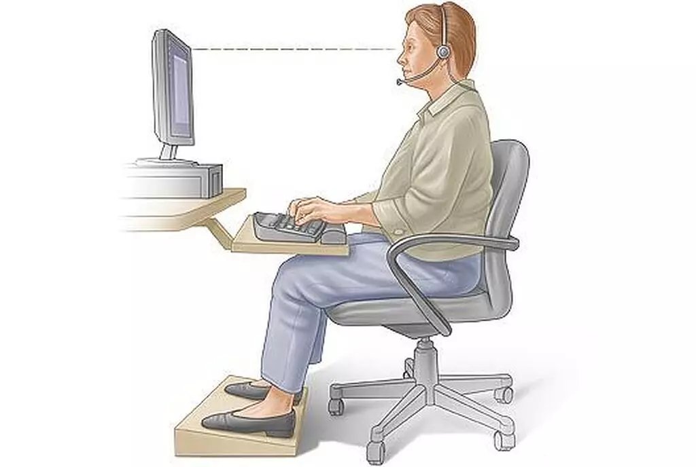

+++
date = '2021-04-09T16:10:13+03:30'
draft = false
title = 'چطور مثل یک تایپیست تایپ کنیم؟'
description = 'تایپ سریع و ده‌انگشتی برای خیلی‌ها مثل رویا می‌مونه، ولی هرکسی می‌تونه با رعایت این موارد مثل یک تایپیست حرفه‌ای تایپ کنه.'
categories = ['tutorial', 'personal-growth', 'productivity']
keywords = ['تایپ ده انگشتی', 'آموزش تایپ', 'تایپ سریع', 'مهارت تایپ', 'حافظه حرکتی', 'برنامه‌های تایپ', 'سایت‌های تایپ', 'تمرین تایپ', 'تایپ فارسی', 'تایپ انگلیسی', 'fast typing', 'touch typing']
tags = ['تایپ ده انگشتی', 'آموزش تایپ', 'تایپ سریع', 'مهارت تایپ', 'حافظه حرکتی', 'برنامه‌های تایپ', 'سایت‌های تایپ', 'تمرین تایپ', 'تایپ فارسی', 'تایپ انگلیسی', 'fast typing', 'touch typing']
image = 'banner.webp'
+++

دیدین یک سری تایپیست‌ها همین‌جوری پشت سر هم و بی‌وقفه تایپ می‌کنن؟ آیا اصلا می‌شه با این سرعت تایپ‌ کرد؟ بله که میشه! در نگاه اول تایپ سریع و ده‌انگشتی غیرممکن به نظر میاد ولی توی این پست قراره به شما نشون بدم که این‌طور نیست.

تایپ‌کردن امروزه خیلی مهارت مهمی شده. دیگه اون دوران که فقط یک سری آدم خاص پشت ماشین‌های تایپ می‌نشستن و تایپ می‌کردن گذشت و الان همه برای خودشون یک تایپیست هستن. وقتی می‌خوایم برای یک نفر پیامک بفرستیم، توی پیام‌رسان‌هایی مثل تلگرام و اینستاگرام با دوستان و آشنایان حرف بزنیم و یا اینکه برای کسی ایمیل ارسال کنیم و خیلی کارهای دیگه نیاز به تایپ‌کردن احساس می‌شه.

تایپ‌کردن از اون دسته کارهایی هست که اصول خیلی راحتی داره و یاد گرفتن اون‌ها زمان کمی از شما صرف می‌کنه ولی برای کسب کردن مهارت باید وقت زیادی روش بگذارید. مثل بازی Two Cars می‌مونه. اصول و کارهایی که باعث لذت‌بخش‌تر کردن مسیر می‌شه رو در ادامه با هم بررسی می‌کنیم.
# کارهایی که قبل شروع به تایپ باید انجام بدین
قبل از شروع باید زمینه رو برای تایپ مهیا کنیم. بدون در نظر گرفتن این موارد بهتون قول می‌دم که قبل از رسیدن به هدف از کار دست می‌کشین.
## ۱. در موقعیت مناسب قرار بگیرین
بهترین وضعیت برای تایپ کردن، نشستن پشت یک صندلی راحت با پشت صاف و تنظیم کردن ارتفاع صفحه‌کلید و نمایشگر هست. نمایشگر رو یک مقدار کمی از چشم‌هاتون پایین‌تر قرار بدین و صفحه‌کلید رو در ارتفاعی بگذارید که دستتون وقتی روش قرار می‌گیره راحت باشه.

لطفا لپتاپ رو موقع تایپ روی پاهاتون نذارید؛ هم باعث فشار آوردن به کمر می‌شه، هم باعث فشار آوردن به چشم‌ها و گردن می‌شه، هم دست‌ها در وضعیت مناسبی نیستن. اگه هرچند وقت یک‌بار مجبورین لپتاپ رو روی پاهاتون بذارین مشکلی نیست ولی از انجام مستمر این کار جدا پرهیز کنین که سلامتی‌تون به خطر میفته.
## ۲. انگشتانتون رو در جای مناسب قرار بدین
یادتون نره که قراره بدون نگاه کردن به صفحه‌کلید و با ده انگشت تایپ کنیم. برای این کار نیاز داریم تا به هرکدوم از انگشتان کلیدهای خاصی رو اختصاص بدیم. این‌طوری نظم خاصی روی دست و انگشت‌ها برقرار می‌شه و کمک می‌کنه که در ادامه، مغز طبق همین نظم موجود به صورت خودکار به انگشتا دستور بده بدون اینکه نیاز باشه شما کار خاصی انجام بدین. یعنی وقتی به کلمه «آسمان» می‌رسین، باید فقط اراده کنین که بنویسین آسمان، خودش نوشته میشه :)

تقریباً همه صفحه‌کلیدها روی کلیدهای j و f یک برجستگی ریزی دارند. این برجستگی برای این هست که تایپیست‌ها بتونن راحت و بدون نگاه کردن به صفحه‌کلید دست‌هاشون رو در جای درستی قرار بدن. انگشت اشاره دست راست روی حرف j و انگشت اشاره دست چپ روی حرف f قرار می‌گیره و بقیه انگشتان کنار هم میان، هردو شصت هم روی space جا خوش می‌کنن.

هم دست چپ و هم دست راست باید یک زاویه‌ای داشته باشن، یعنی اگه شما سعی کنین انگشتاتون رو صاف بگذارید روی کلیدهای مورد نظر، اصلا احساس راحتی نمی‌کنین، سعی کنین مثل چیزی که در تصویر می‌بینین یکم به دست‌ها زاویه بدین.
## ۳. حواستون به نحوه قرارگیری مچ دست هم باشه
مچ دست همیشه جاییه که کسی توجهی بهش نداره. سعی نکنین مچ دست رو به زور به صفحه‌کلید تکیه بدین، بذارین آزاد باشه و اگه به جایی تکیه نده هیچ اتفاق بدی نمیفته.

دقیقاً مثل کسانی که پیانو می‌نوازن، باید منتظر نواختن یک سری کلمه باشین. شاید اوایل یکم رعایت این مورد سخت باشه ولی بعد زمان اندکی راه میفتین.
# چطوری ده انگشتی تایپ کنم؟
انسان همیشه قبل از انجام یک کار جدید، بهونه میاره و به خاطر ترس از شکست، خیلی وقت‌ها از انجام دادن اون کار صرف نظر می‌کنه. افراد زیادی به خاطر این‌که تایپ ده انگشتی به نظرشون سخت و نشدنی هست اصلاً امتحانش هم نمی‌کنند. بگذارید خیلی راحت خاطر نشان کنم که تایپ با ده انگشت از راحت ترین کارهایی هست که هرکسی می‌تونه انجام بده.

کافیه یکم از منطقه مطمئنه فاصله بگیرین. یک بار من خیلی اتفاقی که در حال تایپ با موبایل بودم، مجبور شدم همزمان با تایپ، نگاهم رو از روی صفحه نمایش بردارم و برام خیلی عجیب بود که بدون نگاه کردن هم همون جمله‌ای که می‌خواستم رو نوشتم! برای این‌که این موضوع بازتر بشه باید با یک اصطلاح آشنا بشیم.
## ۱. حافظه حرکتی یا muscle memory چیست؟

حافظه حرکتی به این موضوع اشاره داره که عضلات و ماهیچه‌های بدن بعد از تکرار زیاد یک کار بدون اطلاع ما هم می‌تونن اون کار رو انجام بدن. مثلا یک راننده خودرو رو نگاه کنین، آیا واقعا هر راننده‌ای داره فکر می‌کنه که کلاچ رو با پای چپ فشار بده، پای راستش رو از روی گاز برداره، با دست راستش دنده رو عوض کنه و با دست چپش فرمون رو بچرخونه؟ معلومه که نه! برای بارهای اول راننده باید تک تک این دستورات رو به اعضای بدنش بده، برای همین در ابتدا کار خیلی سختی هست ولی بعد از تمرین‌های زیاد تمام این کارها به صورت خودکار انجام می‌شن. کافیه راننده اراده کنه به سمت راست بپیچه، تمام اون جزییات خودشون انجام می‌شن.

در تایپ کردن هم اوضاع خیلی متفاوت نیست. اوایل کار که حافظه حرکتی ایجاد نشده کار خیلی سختی در پیش دارین، باید برای فشردن تک تک کلیدها یک دستور از مغز به انگشتاتون ارسال بشه، اما بعد از گذشت چند روز که این حافظه حرکتی تشکیل شد، کارتون به مراتب راحت‌تر می‌شه.
## ۲. استفاده از سایت‌ها و برنامه‌های آموزش تایپ

سایت‌ها و برنامه‌های بسیار متنوع و فراوونی وجود داره که شما رو در این راه همراهی می‌کنن. توصیه اکید می‌کنم که از طریق تعدادی از این سایت‌ها و برنامه‌ها یادگیری رو شروع کنین و ادامه بدین. اولاً این‌ها راه مطمئنی برای پیشروی جلوی شما قرار می‌دن، دوماً با کمک این‌ها می‌تونین روند رو به رشدتون رو زیرنظر داشته باشین و انگیزه بگیرین، سوماً می‌تونین با بقیه به رقابت بپردازین و یادگیری رو شبیه به بازی کنین و از همه مهم‌تر این‌که با ارائه متن‌های از پیش تعیین شده باعث می‌شن مسیر برای شما بسیار هموارتر و راحت‌تر بشه.

بسته به شرایط، سایت‌ها یا برنامه‌های خاصی رو می‌شه پیشنهاد داد.

- برای تایپ انگلیسی در سیستم عامل گنو-لینوکس، بدون شک برنامه‌های متنوعی برای کمک به شما هستن که می‌تونین از همشون استفاده کنین ولی پیشنهاد من به شما [Klavaro](klavaro.sourceforge.io) هست. به خاطر ظاهر زیبا و چشم نواز و مهم‌تر از اون، استراتژی آموزش بی‌نظیری که داره.

- برای تایپ انگلیسی و فارسی در ویندوز، یکی از بهترین گزینه‌های رایگان [Rapid Typing](rapidtyping.com) هست که من هم ابتدای کار از این برنامه استفاده کردم.

- برای تایپ انگلیسی در وب، گزینه‌ها خیلی زیاد هستن و انتخاب بین اون‌ها بسیار سخته. من برای افراد مبتدی سایت [keybr](keybr.com) رو پیشنهاد می‌کنم. این سایت با استفاده از الگوریتم‌های ساخت کلمه‌ای که داره روی ترکیباتی که مسلط نیستین تمرکز می‌کنه تا بتونین بهتر و سریع‌تر تایپ کنین. اما بعد از گذشتن از مرحله مبتدی این سایت مناسب نیست، به جای اون از سایت های مسابقه‌ای مثل [typeracer](typeracer.com) می‌تونین استفاده کنین.
# و اما بهترین سایت‌های آموزش تایپ
همه برنامه‌ها و سایت‌های معرفی شده بسیار خوب هستن ولی بهترین نیستن. برای تمرین متن‌های انگلیسی، با فاصله بهترین سایت به نظر من [monkeytype](monkeytype.com) هست. این سایت از نظر بصری و شخصی‌سازی بی‌نظیره. یک پروژه متن‌باز هست و به شدت توصیه می‌شه. واقعا تایپ کردن در این سایت کار لذت‌بخشیه، مراقب باشین معتادش نشین :)

برای تایپ متون فارسی، دوتا گزینه بسیار خوب وجود داره. گزینه اول تلگرام هست! اگه مثل من فردی هستین که خیلی توی تلگرام می‌چرخه و حرف می‌زنه، مطمئنا یک منبع بسیار خوب برای تمرین تایپ کردن همین تلگرام هست. اما گزینه بعد، سایت تایپو هست. این سایت یکی از بهترین سایت‌های تایپ فارسی هست و فکر نمی‌کنم رقیب نزدیکی داشته باشه. آموزش‌های متنوعی داره و بیشتر از اون‌چه که نیاز دارین بهتون می‌ده.

پس یادتون نره به این چند سایت حتماً حتماً سر بزنین چون واقعا سایت‌های ارزشمندی هستند.
## تمرین، تمرین و باز هم تمرین

شما بعد از یادگرفتن اصول تایپ‌کردن که قرارگیری انگشتان در جای مناسب و نگاه نکردن به صفحه‌کلید و نشستن درست و ... هست، فقط نیاز به تمرین دارین. هیچ چیز دیگه‌ای نیاز نیست حتی نوع صفحه‌کلیدی که دارین تاثیری روی تایپ کردن نداره، با صفحه‌کلیدهای معمولی لپتاپ هم میشه به سرعت بالای ۱۵۰ کلمه/دقیقه رسید.

سعی کنین به طور مستمر و روزانه تمرین کنین. یک زمان خاصی از روز رو اختصاص بدین به تمرین تایپ و وقتی که دارین تایپ می‌کنین به چیز دیگه‌ای فکر نکنین و تمرکز داشته باشین. پنج روز تمرین در هفته به مدت ۱۰ دقیقه بهتر از یک بار تمرین در هفته به مدت یک ساعت هست، پس تایپ‌کردن رو فراموش نکنین.
# سخن پایانی
هر هفته آمار سرعت و دقت تایپ‌کردنتون رو بررسی کنین و از رشدی که دارین لذت ببرین. دوستاتون رو هم دعوت به تایپ‌کردن کنین و یک مسابقه‌ای بین هم راه بندازین که باعث رشد سریع‌تر هردوی شما می‌شه. اگه از این مسیر لذت ببرین، می‌تونین تایپ کردن رو به تفریح خودتون تبدیل کنین و با این کار دیگه هیچ سقفی برای سرعت تایپ‌کردنتون نمی‌شه در نظر گرفت.