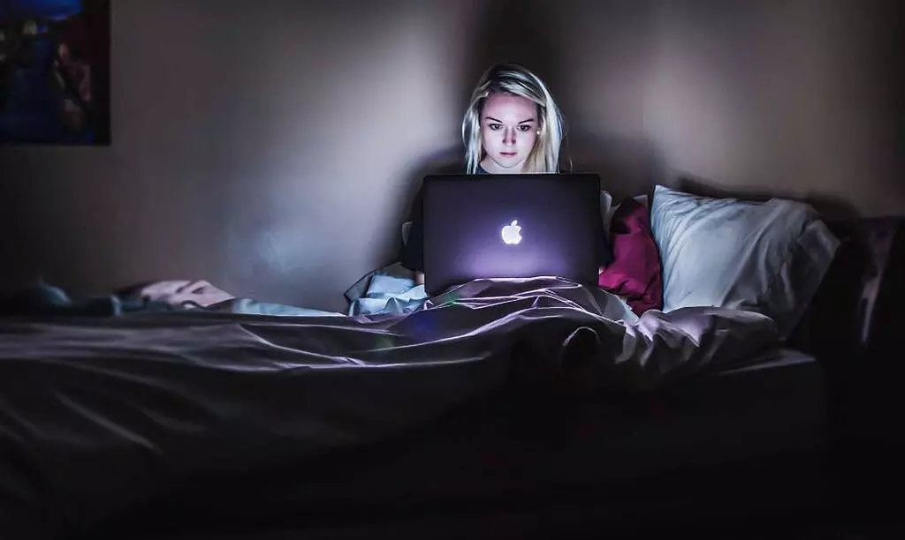
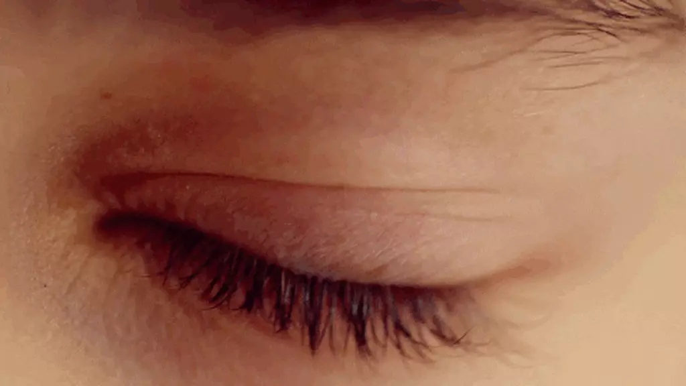
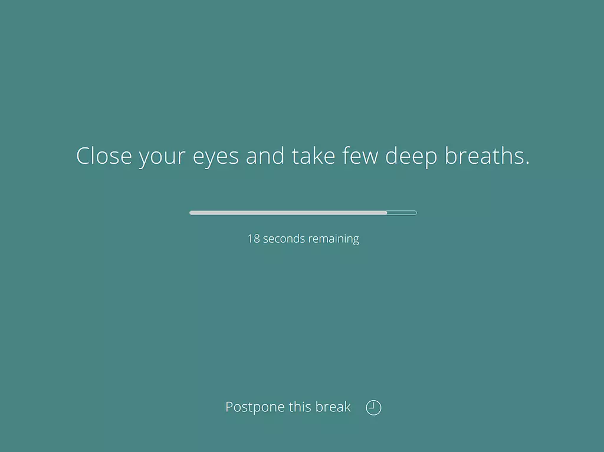

+++
date = '2021-04-23T14:07:39+03:30'
draft = false
title = 'چگونه از چشمان خود در برابر کامپیوتر مراقبت کنیم؟'
description = 'راه‌های مراقبت از چشم‌ها بسیار ساده هستند ولی رعایت نکردن اون‌ها آثار زیان‌باری به همراه داره. پس بیاین این نکات ساده رو رعایت کنیم.'
keywords = ['چشم', 'سلامتی چشم', 'محافظت از چشم', 'کامپیوتر', 'نمایشگر', 'نور آبی', 'عینک مخصوص', 'خشکی چشم', 'استراحت چشم', 'قانون ۲۰-۲۰-۲۰']
categories = ['learning']
tags = ['خودیاری', 'سلامتی', 'چشم']
image = 'eye.webp'
+++

تا حالا شده بعد از مدتی کار با کامپیوتر چشم هاتون قرمز بشن؟ یا اینکه سردرد سراغتون بیاد؟ این‌ها نشونه نامهربونی با چشم‌ها هست و اگه نشونه‌های آشنایی برای شما هستن، بهتره که در این پست با ما همراه باشین تا جلوی مشکلات بزرگی رو بگیریم.

چشم یکی از مهم‌ترین اعضای بدن انسان هست؛ یک لحظه چشم‌هاتون رو ببندین تا به این حرف ایمان بیارین. مثل تمام نعمت‌های دیگه که داریم، قدردان قدرت بینایی هم نیستیم مگر زمانی که مشکلی برای چشم‌ها پیش بیان. اگه مشکلی برای چشم‌هاتون به وجود اومده از وخیم‌تر شدن اوضاع جلوگیری کنین و اگه هنوز چشم‌های تیزی دارین، از مشکلات احتمالی پیشگیری کنین. بعد از اینکه چشم‌هاتون ضعیف شدن، دیگه راه برگشتی وجود نداره پس از همین الان به فکرشون باشین!

تو دنیای مدرن امروزی، استفاده از نمایشگرها در همه جا مشاهده میشه؛ وسایلی که همیشه در حال سر و کله زدن باهاشون هستیم و زمان زیادی از روز رو در حال نگاه کردن به اون‌ها هستیم. همین باعث میشه نسبت به گذشته چشمان ما در معرض نورهای مضر بیشتری قرار بگیرن، و آسیب‌پذیری بالاتری داشته باشن. خبر خوب اینه که میشه با یک سری تدابیر که سخت هم نیستند به طور کامل جلوی این ضررها رو گرفت!
# تنظیم فاصله از صفحه‌نمایش

آیا به این دقت کردین که چرا ضرر صفحه‌نمایش کامپیوتر خیلی بیشتر از ضرر تلویزیون هست؟ به خاطر اینه که فاصله کامپیوتر خیلی خیلی کمتر از فاصله تلویزیون هست. سعی کنین که حداقل به اندازه یک متر با صفحه‌نمایش فاصله داشته باشین. یک راه ساده برای بررسی این‌که فاصله درستی دارین یا خیر اینه که ببینین دستتون بهش میرسه یا نه! به همین سادگی، نباید دستتون به صفحه نمایش برسه.
# تنظیم نور صفحه‌نمایش

نور صفحه‌نمایش باید «تنظیم» بشه. منظور از تنظیم، همیشه کم کردن نور نیست. جوری نور رو تنظیم کنین که هماهنگ با نور محیط باشه؛ به طوری که وقتی به صفحه‌نمایش نگاه می‌کنین احساس راحتی کنین.

تقریبا تمام صفحه‌نمایش ها برای کم کردن نور صفحه، فرکانس و PWM رو دست‌کاری می‌کنن. نیازی نیست ما بدونیم این اصطلاحات تخصصی چی هستن اما بگذارین براتون توضیح بدم. لامپی که اتاق رو روشن می‌کنه در دقیقه به تعداد بسیار زیادی روشن و خاموش میشه ولی به دلیل سرعت بالا ما متوجه این موضوع نمیشیم. همین موضوع برای صفحه‌نمایش ها هم صادق هست، و برای کم کردن نور تعداد و مدت زمان این خاموش و روشن شدنه تغییر می‌کنه.

این تغییر هنگام کم کردن نور باعث آسیب رسوندن به چشمان ما میشه. از این روش استفاده میشه چون قیمت پایین‌تری دارن و مصرف انرژی کمتری هم دارن. اما برای این موضوع میشه از نرم افزار Iris استفاده کرد. این نرم افزار نور رو روی ۱۰۰٪ قرار میده و خودش به صورت نرم افزاری میزان نور سفیدی که قراره بیاد رو کاهش میده. با این کار دیگه چشم‌ها آسیبی نمی‌بینن. این برنامه رایگان نیست، ولی با دعوت کردن از دوستاتون می‌تونین ازش برای مدت زمان زیادی استفاده کنین.

(برای دانلود Iris روی [این لینک](https://iristech.co/invite/?from=uadur) کلیک کنید)
# استفاده از عینک مخصوص

عینک‌های مخصوصی برای همین مسئله وارد بازار شدند؛ البته تشخیص این‌که چه عینکی کاری که گفته رو انجام میده و کدوم عینک مناسب شماست، کار سختی هست. بهترین و مطمئن‌ترین راه، مراجعه به پزشک هست. اگه واقعا برای چشم‌هاتون ارزش قائلید، پاشید برید پیش یک چشم پزشک مجرب، هم چشمتون رو معاینه کنین و هم برای عینک‌های مخصوص چشم خودتون راهنمایی بگیرین.

یک راه دیگه برای جلوگیری از ورود امواج مضر به چشم، استفاده از نرم افزارهاست که نور آبی رو کاهش میدن. نور آبی به خاطر فرکانس بالایی که بین رنگ‌ها داره، انرژی بیشتری با خودش حمل می‌کنه و ضرر بیشتری داره. نرم افزارهای زیادی برای این‌کار هستن که می‌تونید ازشون استفاده کنید که یکی از اون‌ها Iris هست.
# به صورت ارادی پلک بزنید!

پلک زدن باعث جلوگیری از خشکی چشم میشه. در حالت طبیعی، پلک زدن خودکار انجام میشه ولی وقتی روی چیزی تمرکز می‌کنیم، مثل صفحه‌نمایش، میزان پلک زدن به طرز چشم‌گیری کاهش پیدا می‌کنه. در این حالت بهتره که به صورت ارادی پلک بزنیم تا جبران مافات بشه.

اما پلک زدن ارادی، یعنی در هر لحظه به پلک زدن فکر کردن، و این یعنی از دست رفتن تمرکز. منطقی نیست هر ۵ ثانیه با اراده پلک بزنیم تا چشممون خشک نشه، ولی نتونیم به کارمون برسیم. برای این مشکل، بهتره که هر بیست دقیقه، یک بار از پشت کامپیوتر بلند شین، برین برای چند دقیقه یه کار دیگه انجام بدین. چنتا نفس عمیق بکشین و یه لیوان آب بخورین. توی این مدت پلک زدن به روند عادی خودش برمی‌گرده و دیگه چشمتون خشک نمیشه.

باز هم می‌خوام یک برنامه معرفی کنم که به شما کمک کنه هر بیست دقیقه از سر جاتون بلند شین. کاری که این برنامه انجام میده خیلی ساده هست. هر بیست دقیقه بهتون اعلام می‌کنه که یکم به خودتون استراحت بدین! این کار علاوه بر اینکه برای چشم‌هاتون خوب هست، باعث میشه حالت بدنتون هم به درستی شکل بگیره و از آسیب به ستون فقرات جلوگیری کنه.

(برای دانلود Stretchly روی [این لینک](https://hovancik.net/stretchly/) کلیک کنید)
# به چشم‌هاتون استراحت بدین!

هرچی بیشتر از چشم‌هاتون کار بکشین، بیشتر خسته میشن. هرچی چشم خسته‌تر باشه، احتمال آسیب دیدنش بالاتره. پس هر چند وقت یک‌بار، به چشم‌هاتون استراحت بدین. دست از نگاه کردن به صفحه‌نمایش بردارین، چشم‌هاتون رو ببندین و یکم بهشون مهلت بدین تا خودشون رو دریابن!

هرچی تمرکز چشم روی چیزهای نزدیک‌تری باشه، فشار بیشتری روش وارد میشه؛ پس نگاه کردن به دوردست‌ها چشم‌ها رو از این فشار آزاد می‌کنه. یک قانون معروفی در این زمینه وجود داره که به قانون ۲۰-۲۰-۲۰ معروفه. این قانون میگه هر ۲۰ دقیقه، به مدت ۲۰ ثانیه به یه چیزی که به فاصله ۲۰ متری از شماست نگاه کنین.

یک تمرین دیگه برای راحتی چشم‌ها، اینه که چشم‌ها رو ببندین، در همین حال که بسته هست اون رو به آرومی تکون بدین.
# سخن پایانی

چشم‌ها یکی از بزرگترین دارایی‌های ما هستند. اگه ضعیف بشن دیگه راه برگشتی برای خوب شدنشون وجود نداره. پس از همین الان به فکر سلامتی چشم‌هاتون باشین تا بعدا حسرت یک دید خوب رو دلتون نمونه!