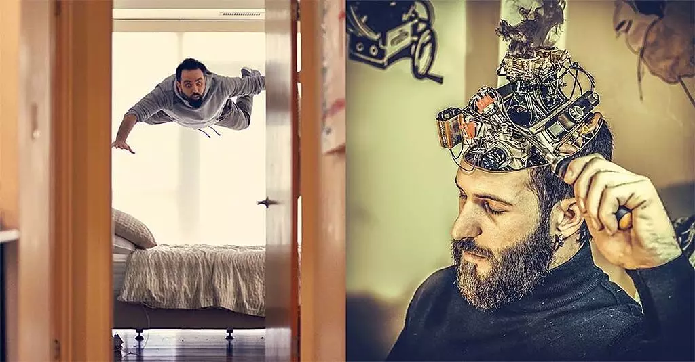
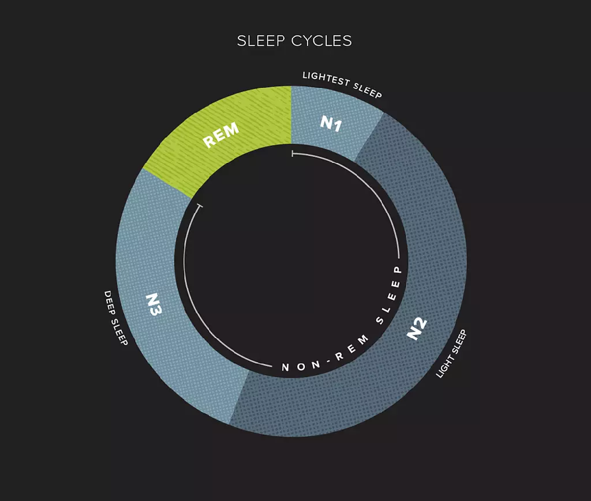
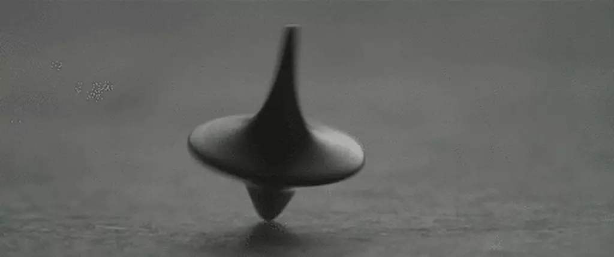
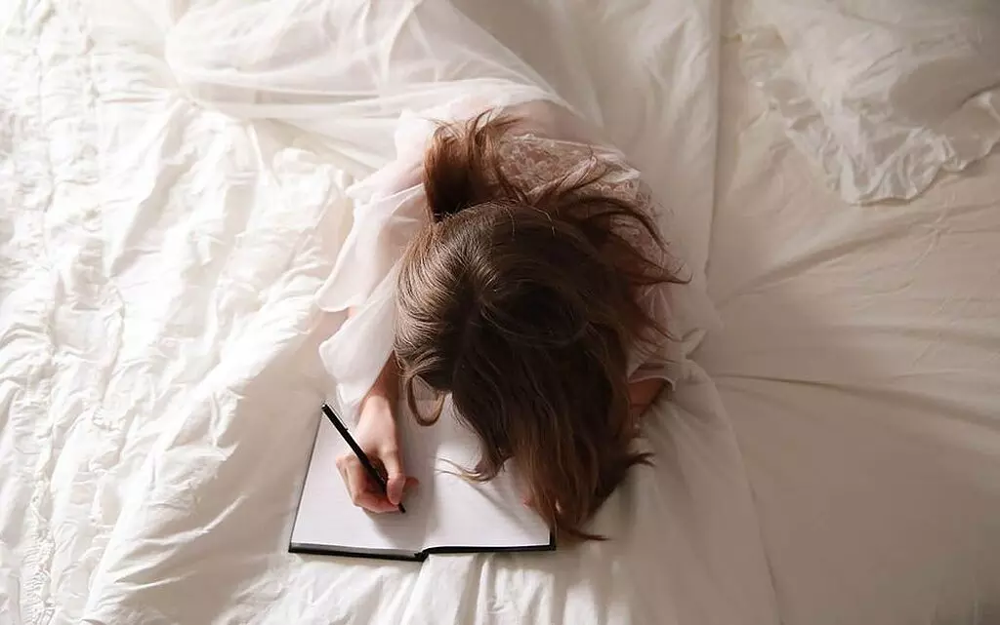

+++
date = '2021-05-22T18:54:48+03:30'
draft = false
title = 'رویای شفاف، تجربه دنیایی جدید'
description = 'رویای شفاف چیه؟ چه کارهایی میشه تو دنیای خواب انجام داد؟ آیا هرکسی می‌تونه خواب شفاف ببینه؟'
categories = ['tutorial', 'science']
keywords = ['رویای شفاف', 'تجربه خواب شفاف', 'آموزش رویای شفاف', 'lucid dreaming', 'lucid dream techniques', 'خواب شفاف', 'تکنیک‌های خواب شفاف', 'self-awareness in dreams', 'خودآگاهی در خواب', 'REM sleep', 'چرخه خواب', 'خواب REM', 'خواب درمانی', 'dream journal', 'دفترچه رویا', 'خودشناسی در خواب', 'self-discovery in dreams']
tags = ['رویای شفاف', 'تجربه خواب شفاف', 'آموزش رویای شفاف', 'lucid dreaming', 'lucid dream techniques', 'خواب شفاف', 'تکنیک‌های خواب شفاف', 'self-awareness in dreams', 'خودآگاهی در خواب', 'REM sleep', 'چرخه خواب', 'خواب REM', 'خواب درمانی', 'dream journal', 'دفترچه رویا', 'خودشناسی در خواب', 'self-discovery in dreams']
image = 'banner.webp'
+++

تو خونه نشسته بودم که یهو یکی در زد. در رو باز کردم. داییم به همراه خانوادش اومده بودن سری به ما بزنن. به رسم ادب رفتم پیششون و سلام و احوال‌پرسی کردم. وقتی رفتم به داییم دست بدم، دستم از توی دست داییم رد شد! در یک آن فهمیدم که دارم خواب می‌بینم، همه‌چی واضح و ملموس شد. می‌دونستم این یک خوابه ولی همچنان درون خواب بودم. من وارد یک رویای شفاف شده بودم!

ما تقریبا ۸ ساعت در شبانه‌روز می‌خوابیم. زمان بسیار زیادیه و در مجموع یک سوم عمرمون رو در بر می‌گیره. برای مثال یک فرد ۹۰ ساله به مدت ۳۰ سال خوابیده! خیلی‌ها دوست ندارن ۳۰ سال از عمرشون رو صرفا به خواب بگذرونن که هیچ فایده‌ای (در ظاهر) براشون نداره. پس بهتره این افراد که امیدوارم شما هم جزوشون باشین، به خواب و استفاده بهتر از اون اهمیت بدن.

رویای شفاف ما رو وارد دنیای جدیدی می‌کنه. دنیایی که هنوز اطلاعات کاملی ازش در دسترس نیست و نیازمند ماجراجویی افرادی مثل ماست که سر از کارش در بیاریم.

# رویای شفاف چیست؟

رویای شفاف یعنی وقتی داریم خواب می‌بینیم، آگاه باشیم که داریم خواب می‌بینیم. این تعریف خیلی جذاب نیست. تعریف دل‌انگیزتر رویای شفاف میشه «رفتن به یک دنیای دیگه که خدای اون دنیا ماییم».

اون دنیا دقیقا همون‌جوری خواهد بود که ما می‌خوایم. در حالت معمول، محیطی که خواب در اون شکل می‌گیره توسط ضمیر ناخودآگاه ما شکل می‌گیره. ولی با شفاف شدن رویا، ممکنه این کار به دست ضمیر خودآگاه ما سپرده بشه و هرکاری که فکرش رو بکنین میشه انجام داد.

رویای شفاف در نگاه دیگه یک راه ارتباطی با ضمیر ناخودآگاهه. این کار به شدت باعث خودشناسی بیشتر میشه. شاید فکر کنین خودتون رو خیلی خوب میشناسین ولی باید بگم خیلی مطمئن نباشین. توی رویای شفاف میتونین گله‌های خودتون از خودتون رو بشنوین و خودتون رو اصلاح کنین. که جلوتر بیشتر در موردش حرف می‌زنم.

# پشتوانه علمی رویای شفاف

ما وقتی می‌خوابیم، وارد یک چرخه میشیم. این چرخه رو میشه به دو قسمت REM (که خلاصه Rapid Eye Movement هست) و NonREM تقسیم کنیم. در قسمت REM هست که ذهن ما فعالیت خودش رو زیاد می‌کنه و تقریبا همه خواب‌هایی که میبینیم در این مرحله رخ میده. در چرخه اول حدود ۹۰ دقیقه خواب NonREM داریم و ۱۰ دقیقه خواب REM و در چرخه‌های بعدی این نسبت تغییر می‌کنه و خواب REM بیشتر میشه. به طوری که اواخر خواب حدود یک ساعت خواب REM خواهیم داشت.

خواب شفاف هم مثل هر خواب دیگه‌ای در مرحله REM شکل می‌گیره. هنگام خواب، عملکرد مغز شبیه به عملکرد مغز در بیداری هست، حتی بعضی از قسمت‌های مغز فعال‌تر هم هستن. این حرف به این معنیه که درک و دریافتی که ما هنگام خواب از محیط اطراف داریم، نه تنها هیچ فرقی با دنیای واقعی نداره، بلکه ممکنه خیلی قوی‌تر از واقعیت هم باشه. ما در خواب می‌شنویم، می‌بینیم، لمس می‌کنیم، می‌چشیم و درواقع از تمام حواسمون بهترین استفاده رو می‌بریم.

ممکنه عده‌ای خواب شفاف رو رد کنن و بگن همه این حرف‌ها الکیه. خواب شفاف توسط آزمایش‌های علمی اثبات شده و هیچ بحثی در این زمینه وجود نداره. تنها عضوی از بدن که هنگام خواب فلج نمیشه چشم‌هامونه. دکتر استفن لابرگ، از طریق چشم تونست پیام‌هایی رو بین دنیای واقعی و دنیای خواب رد و بدل کنه و وجود خواب شفاف رو اثبات کنه.

تحقیقات گسترده‌ای در زمینه رویای شفاف و اثرات مثبتش شکل گرفته و مشخص شده که از طریق رویای شفاف میشه کارهای بسیار خوبی انجام داد. حتی خواب درمانی هم به‌وجود اومده که با رویای شفاف سر و کار داره.

# کارهایی که می‌توان در خواب شفاف انجام داد

زندگی سختی‌های خودش رو داره و همیشه نمیشه روز بی‌نقصی داشت. به کمک رویای شفاف، میشه تجربه خوشایندی رو قبل از شروع روز ساخت، که همین باعث بهتر شدن تجربه روزانه تو زندگی واقعی میشه. شما می‌تونین تو خواب شفاف کارهای زیر رو انجام بدین.

اگه به یک شهر علاقه خاصی دارین، می‌تونین در رویاهاتون به اون شهر برین و لحظات به یاد موندنی بسازین.

اگه طرفدار تیمی مثل منچستریونایتد هستین و دوست دارین برای یک بار هم که شده بازی تیمتون رو ببینین، در رویا این کار برای شما مثل آب خوردنه، تازه میتونین جوری بازی رو رقم بزنین که مثل همیشه بعد دقیقه نود شاهد کامبک تیمتون در تئاتر رویاها باشین.

اگه فرد خاصی که بهش علاقه داشتین از دنیا رفته، می‌تونین اونو در رویا ملاقات کنین و باهاش یک دل سیر صحبت کنین، بغلش کنین، بدون هیچ مقصدی یه مدت با هم پیاده‌روی کنین و به آرامش برسین.

اگه فرد شکمویی هستین، توی خواب با خیال راحت می‌تونین به خوردن غذاهای موردعلاقتون بپردازین. اصلا هم نگران چربی و شکر و قند و هزارتا چیز دیگه نباشین چرا که هیچ ضرری ندارن :)

اگه از رییس شرکتتون یا مدیر مدرستون یا استاد دانشگاهتون بدتون میاد، توی خواب هر بلایی که دلتون می‌خواد سرش بیارین این خیلی جوابه.

اگه خیلی دیگه این‌‌کاره شدین، اصلا دنیا رو تغییر بدین، خودتون رو نامرئی کنین، بُعد چهارم رو بسازین و جاذبه رو از بین ببرین و رنگ‌های جدید ایجاد کنین. با سرعت نور حرکت کنین، در زمان سفر کنین، با خود آیندتون صحبت کنین و هزارتا کار دیگه.

تقریبا لیست کارهایی که میشه انجام داد بی‌نهایته. علاوه بر این‌ها، میشه کارهای دیگه‌ای هم انجام داد که روی زندگی واقعیمون هم موثر باشن. این خاطره رو از زبان یه نفر دیگه بخونیم:

«من یک نویسنده هستم. همیشه دوست داشتم قبل از این‌که نوشته من به چاپ برسه یا فیلمش ساخته بشه، اون چیزی که نوشتم رو تصور کنم. با رویای شفاف دیگه خیلی این کار راحت‌تر شده. درون یک اتاق کوچیک زندانی شده بودم. همه چیز سفید بود. هیچ راه فراری نبود. یهو متوجه شدم این یه خواب باید باشه، چون نمیدونستم چطوری به اونجا رفته بودم. صحنه‌ای که اون شب نوشته بودم رو تصور کردم و رو به عقب برگشتم. دیگه درون اون اتاق نبودم، درون راهرو یک قطار قدیمی بودم. سال ۱۹۸۷ بود و همه لباس‌های قدیمی داشتن. همون چیزی بود که تو ذهنم بود. باید میرفتم به کوپه ۳۶ تا شخصیت اصلی داستانم رو ملاقات کنم...»

در کنار این داستان، افراد زیاد دیگه‌ای هم خواب‌های جالبی دیدن که توی زندگی واقعی هم بهشون کمک کرده. برای مثال شخصی که از سخنرانی در جمع می‌ترسیده، در رویا این کار رو امتحان کرده و به ترسش غلبه کرده. ورزشکار یا هنرمندی که در خواب تمرین کرده تا در واقعیت از لحاظ ذهنی کارش بی‌نظیر بشه. معماری که درون خواب به طراحی‌های فوق‌العاده دست پیدا کرده و در نهایت آهنگ‌سازی که ملودی مورد نظرش رو از رویای شفافش گرفته.

همه این‌ها به کنار، خواب شفاف امکانی به ما میده که جاهای دیگه به این راحتیا پیدا نمی‌کنین. اون هم امکان ارتباط مستقیم با ناخودآگاهه. اگه اقدام به تغییر محیط رویاهامون نکنیم، ضمیر ناخودآگاه اون‌ها رو میسازه. از این طریق میشه فهمید ناخودآگاهتون، که همون خود واقعیتونه، چه حرفایی برای گفتن داره. جالب‌تر این‌که می‌تونین باهاش حرف بزنین، درجا جوابتون رو میده! یا این‌که عده‌ای تونستن در رویای شفاف، ضمیر ناخودآگاهشونو در ظاهر خودشون ببینن و باهاش کلی صحبت کنن.

# چطور رویای شفاف ببینیم؟

شاید تا الان خیلی به فکر فرو رفتین. با خودتون گفتین خوش به حال کسایی که خواب شفاف دیدن، من که نمیتونم. باید بگم که رویای شفاف قابل یادگیریه. روش‌های مختلفی هم وجود داره که در ادامه با هم بررسی می‌کنیم.

## بررسی واقعیت

توی زمان بیداری اگه عادتی در خودتون ایجاد کنین، در زمان خواب هم همون کارها رو انجام میدین. پس اگه توی واقعیت مکرر بررسی کنین که بیدارین یا نه، در خواب هم این عمل رو انجام میدین. درسته که محیط خواب و بیداری بسیار شبیه به هم هستن و خیلی تشخیص تفاوتشون سخته، اما نشونه‌هایی وجود دارن که خواب رو لو میدن.

- زمانی که خوابیم، قسمت‌هایی از مغزمون خاموش میشن و دیگه کار نمی‌کنن. برای مثال نمی‌تونیم بشماریم. برای بررسی خواب بودنتون، تعداد انگشت‌های دستتون رو بشمارین. اگه نتونستین، مطمئن باشین که خوابین.
- زمانی که خوابیم، نمی‌تونیم خودمون رو بُکشیم. پس از این ترفند هم میشه استفاده کنیم. نیازی نیست خودمون رو بکشیم چون اگه دنیای واقعی باشه راه برگشتی نیست، اما میشه برای مثال دماغمون رو با دست بگیریم، اگه با این وجود تونستیم نفس بکشیم، پس خوابیم.
- انگشت اشاره رو به کف دست مقابل فشار بدین، اگه از کف دست رد شد یعنی دارین خواب می‌بینین. من از این روش برای تشخیص خواب بودن استفاده کردم و جواب گرفتم.
- مغز نمی‌تونه آسمون رو مجسم کنه. یه جوری میشه که انگار یه بچه ۴ ساله با نرم‌افزار paint ویندوز اونو رنگ کرده. من یک بار تو خواب آسمون رو نگاه کردم و از شدت مسخره بودنش خندم گرفت و بیدار شدم :)
- موارد دیگه‌ای هم هستن، مثلا اگه توی آینه خودتونو نگاه کنین دقیقا شبیه خودتون نیست، یا ساعت کارکرد عادی نداره و چیزهای دیگه که تو اینترنت می‌تونین پیدا کنین.

## رویا نویسی

تحقیقات نشون داده که تقریبا همه افراد خواب شفاف دیدن، ولی چرا تعداد افرادی که همچین ادعایی دارن کمه؟ دلیلش برمی‌گرده به حافظه. رویای شفاف خیلی کم پیش میاد، و زمانی هم که پیش میاد فراموش میشه. دقیقا مثل خواب‌های روزانه که فقط تعداد کمی رو به یاد می‌سپریم. برای رفع این مشکل باید کاری کنیم تا خواب رو فراموش نکنیم. بهترین و موثرترین کار برای این امر، نوشتن رویاهاست. یک دفترچه مخصوص برای رویاهاتون بگیرین و گوشه تختتون بذارین. هر روز صبح که بیدار شدین، شروع کنین هرچی که یادتون میاد رو بنویسین. تضمین می‌کنم در عرض حدود یک هفته انجام این کار شما هر شب تقریبا ۳ خواب رو به طور کامل به یاد میارین!

رویا نویسی علاوه‌ بر این‌که کمک می‌کنه خواب‌ها رو به یاد داشته باشیم، فواید دیگه‌ای هم داره. شما هر زمان دیگه‌ای، مثلا 50 سال دیگه هم بیاین این متن رو بخونین، خواب رو با تمام جزییات دوباره به یاد میارین. جدای از اون، میشه روی این خواب‌ها تحقیقاتی انجام داد و نتایج مهمی گرفت. برای مثال تعبیر خواب.

تقریبا تمام افراد، یک سری نشونه‌های تکراری در خواب می‌بینن. این نشونه‌ها رو میشه تنها از طریق رویا نویسی تشخیص داد. برای مثال من در زمانی که رویا نویسی می‌کردم، متوجه شدم به طور مکرر هم‌کلاسی‌هام رو در خواب می‌بینم. با کمی دقت فهمیدم که به شدت دلم برای هم‌کلاسی‌هام تنگ شده چون خیلی وقت بود نمی‌دیدمشون.

## تکنیک MILD

این کلمه مخفف Mnemonic Induction to Lucid Dreaming هست. توی این تکنیک باید قبل از خواب با خودتون تکرار کنین که امشب قراره رویای شفاف ببینین. این کار درصد احتمال دیدن رویای شفاف رو بالا می‌بره. در کل هرچی بیشتر در روز به فکر کردن در مورد خواب و رویا بپردازین احتمال دیدن رویای شفاف بالاتر میره و راحت‌تر میشه شفاف شد.

## تکنیک WBTB

این کلمه مخفف Wake Back To Bed هست. توی این تکنیک، زمانی رو که احتمال میدین در مرحله REM هستین انتخاب می‌کنین تا بیدار شین. برای مثال ۵ ساعت بعد از این‌که به خواب رفتین زمان مناسبیه. به مدت حدود نیم ساعت کارهای مورد علاقتون رو انجام بدین تا کاملا هشیار بشین. بعد از نیم ساعت دوباره بخوابین، این بار مستقیم به خواب REM میرین و مزیتش اینه که هشیار هم هستین.

افرادی که برای نماز بیدار میشن، این کار براشون هیچ زحمت اضافه‌ای نداره. نماز برای شکرگزاری هست، شکرگزاری در صبح زود وقتی که از خواب بیدار شدین، می‌تونه معنویت خاصی داشته باشه، اگه یه مقدار meditation هم چاشنی کار کنین و بعد به قصد رویای شفاف به خواب برین احتمال موفقیتتون خیلی بالا میره.

# چند توصیه

دیدن رویای شفاف کار سختی نیست، اما اگه بخواین هر موقع که اراده کردین به خواب شفاف برین سال‌ها تمرین نیاز دارین. رمز موفقیت در دیدن رویای شفاف تمرین مستمر تکنیک‌های گفته شده هست و اوایل کار انتظار نداشته باشین هفته‌ای ۵ بار به خواب شفاف برین. شاید برای اولین بار نیاز باشه یک ماه این تمرین‌ها رو انجام بدین تا نتیجه بگیرین. پس صبور باشین. کم کم راه براتون هموارتر میشه.

اگه می‌خواین زودتر به رویای شفاف برسین، مطالب مربوط بهش رو در اینترنت جستجو کنین و زمان زیادی رو به تحقیق در موردش بپردازین. کارهایی که در روز انجام میدیم معمولا در خواب نمود پیدا می‌کنه پس این می‌تونه احتمال دیدن رویای شفاف رو افزایش بده.

یکی از بزرگ‌ترین چالش‌ها در دیدن رویای شفاف، کوتاه بودنشه. وقتی برای اولین بار در خواب متوجه میشین که دارین خواب می‌بینین، خوشحالی عظیمی سرتاسر وجودتون رو فرا می‌گیره، ضربان قلبتون میره بالا و از شدت هیجان معمولا بیدار میشین. این کاملا طبیعیه. خودتون رو به خاطر زود بیدار شدن سرزنش نکنین. شاید دفعه بعد بتونین خودتون رو کنترل کنین.

خواب شفاف در کنار خوبی‌های زیادی که داره ممکنه یک سری معایبی هم داشته باشه. برای رسیدن به خواب شفاف، باید تلاش زیادی انجام بدین، زیاد بخوابین و در بعضی تکنیک‌ها مثل WBTB وسط خواب بیدار بشین. این موارد ممکنه باعث به هم خوردن زندگی روزانتون بشه. پس تعادل بین زندگی روزانه و رویا رو برقرار کنین که از جفتشون سود ببرین.

اگه به این موضوعات علاقه دارین توصیه می‌کنم در مورد OBE و NDE هم جستجو کنین تا پاتون رو یکم فراتر بذارین. (در ماه رمضان 1400 برنامه‌ای در شبکه ۴ پخش می‌شد که افراد تجربه خودشون از OBE و NDE رو به اشتراک می‌گذاشتن)

# سخن پایانی

امیدوارم این نوشته انگیزه‌ای شده باشه برای شما تا حداقل تلاشی برای رسیدن به رویای شفاف انجام بدین. اگه تجربه رویای شفاف رو در گذشته داشتین خوشحال میشم در نظرات با ما در میون بذارین.