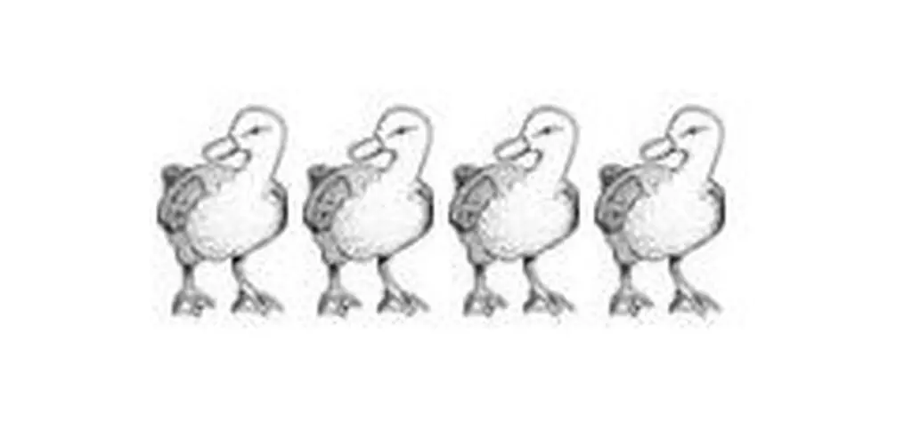

+++
date = '2021-05-14T19:09:48+03:30'
draft = false
title = 'سیر تکاملی اعداد'
description = 'سر و کله اعداد از کجا پیدا شد؟ چرا ما از اعداد به شکل امروزی استفاده می‌کنیم؟ چرا ۱۰ رقم بیشتر نداریم؟'
keywords = ['اعداد', 'سیستم اعداد', 'خوارزمی', 'اعداد رومی', 'سیستم هندی-عربی']
categories = ['scientific']
tags = ['mathematics', 'history']
image = 'numbers.webp'
+++

شمارش از کجا آغاز شد؟ چه چیزی باعث شد که از اعداد استفاده کنیم؟ چرا از این ارقام و به این شکل برای نمایش اعداد استفاده می‌کنیم؟

مشاهده روند تکاملی استفاده از اعداد از گذشته تا کنون، جدای از جذابیت باعث نگاه متفاوت ما به اعداد میشه. پاسخ‌دادن به این چراها تاثیر به سزایی در درک مفاهیم مربوط به علوم کامپیوتر و اعداد دودویی داره.
# آشنایی ما با اعداد

خودتون رو بذارین جای انسان‌هایی که تازه با نوشتن آشنا شده بودن. افرادی که برای اطلاع از دارایی‌هاشون نیاز داشتن تا حداقل آماری از اون‌ها داشته باشن.

احتمالاً برای اولین بار افراد از نقاشی برای شمردن استفاده می‌کردن. کسی که ۴ تا اردک داشته، همچین چیزی رو روی یک تیکه کاغذ رسم می‌کرده:

رفته رفته کسی که مسئول نقاشی این اردک‌ها بود از کارش خسته میشه، با خودش فکر می‌کنه که خب چه کاریه، چرا فقط یکبار اردک رو نکشم و تعدادش رو با چوب خط نشون ندم؟ پس بعد از این فکر ۴ تا اردک رو به این شکل نشون می‌داد:

بعد از مدتی این فرد میبینه که این مدل برای اعداد بزرگ خیلی مناسب نیست. مثلا یکی که وضعش خیلی خوب بوده و ۲۷ تا اردک داشته باید این شکل رو می‌کشیده:

حتما با خودش میگه این‌جوری که نمیشه! حتما باید یه راه بهتری برای نمایش تعداد اردک‌ها وجود داشته باشه. این‌جوری بود که اولین سیستم اعداد به‌وجود اومد.
# سیستم اعداد رومی
از بین سیستم‌هایی که اون زمان به‌وجود اومدن، تنها سیستم اعداد رومی هم‌چنان استفاده میشه. بعضی وقت‌ها اون‌ها رو میشه روی ساعت‌ها دید، بعضی وقت‌ها هم روی اسم‌گذاری بعضی محصولات مثل GTA V یا IPhone X.

این سیستم بسیار ساده هست. تنها کاری که باید انجام بدین کنار هم گذاشتن ارقام هست. برای جمع کردن هم کافیه دوتا عدد رو به هم بچسبونین و تمام! برای مثال جمع Xو X میشه XX.

اما بزرگ‌ترین مشکل این سیستم، پیچیده شدن برای اعداد بزرگ، و نداشتن یک رویه ساده برای انجام ضرب و تقسیم هست. برخلاف این موارد، این سیستم اعداد تا حدود قرن ۸ و ۹ میلادی در اروپا استفاده می‌شده!
# خوارزمی، ردپای ایران در سیستم اعداد

محمد خوارزمی به جرات یکی از بزرگ‌ترین ریاضی‌دانان قرون وسطی‌ است که حتی تا امروز از آثارش استفاده میشه. به دلیل کارهای بزرگی که در زمینه جبر انجام داده، پدر جبر لقب گرفته. اصلا واژه جبر از کتابی که خوارزمی نوشته گرفته شده. کلمه الگوریتم هم که امروزه سر زبان‌ها افتاده، همون الخوارزمی هست!

یکی از کارهای بزرگ خوارزمی، دستگاه اعداد هندی-عربی یا هندی-فارسی هست. دستگاه اعدادی که هنوز هم به طور فراگیر در جهان ازش استفاده میشه. دلیل نام‌گذاری هندی-عربی برای این دستگاه، مطلع شدن اروپاییا از این دستگاه از طریق هند و عرب‌ها هست.

این دستگاه از چند لحاظ با دستگاه های قبلی متفاوت هست:

- سیستم هندی-عربی از ارزش مکانی استفاده می‌کنه. این یعنی یک رقم در مکان‌های مختلف معناهای مختلفی داره. برای مثال 10 و 100 هردو یک ۱ دارن، ولی ارزش ۱ در عدد دوم بیشتره، چون در مکان متفاوتی واقع شده.
- تمام سیستم‌های قبلی چیزی دارن که سیستم هندی-عربی نداره، و اون نماد مخصوصی برای عدد ۱۰ هست. برخلاف بقیه، این سیستم از ارزش مکانی برای تولید عدد ۱۰ استفاده می‌کنه.
- سیستم هندی-عربی چیزی داره که هیچ‌کدوم از سیستم‌های قبلی ندارن، و اون نمادی برای عدد ۰ هست. شما نمی‌تونین در سیستم‌های دیگه آثاری از ۰ ببینین!

حضور صفر برای ما خیلی خیلی مهمه. علاوه بر این‌که ما رو قادر به استفاده از ارزش مکانی می‌کنه، عملیاتی مثل ضرب و تقسیم هم با وجود صفر به شدت آسون میشن.

ساختار این سیستم رو میشه از طریق تلفظشون فهمید. برای مثال ۲۸۶۵ رو «دو هزار و هشت صد و شصت و پنج» تلفظ می‌کنیم. حضور «هزار» و «صد» مشخصاً داره ساختاری رو نشون میده.

اگه یه خورده مرتب‌تر بنویسیم:

و نهایتاً میشه اون‌ها رو به این شکل نوشت:

هر مکانی در این سیستم، مربوط به توانی از ۱۰ هست. به همین دلیل نیاز به نمادی برای عدد ۱۰ نیاز نداریم. احتمالاً متوجه شدین که به این دستگاه مبنای ۱۰ میگن. خوبی این دستگاه اینه که به راحتی میشه همین روش رو برای مبناهای دیگه هم استفاده کرد.
# جمع و ضرب
این سیستم اعداد به ما قدرتی میده که بتونیم برای جمع و ضرب، مسئله رو به زیرمسئله‌هایی تبدیل کنیم که حل کردنشون ساده تره.

برای مثلا ۳۶ + ۶۴ رو میتونیم در دو مرحله انجام بدیم:

برای ضرب هم همین کار رو میشه انجام داد:

به همین روش میشه زیرمسئله‌ها رو باز هم ساده‌تر کرد تا این‌که به ساده‌ترین حالت ممکن برسیم. در واقع تنها به این نیاز داریم که عمل جمع و ضرب رو تنها برای یک رقم به خاطر بسپاریم. به خاطر همین در دبستان به ما گفتن جدول ضرب و جدول جمع حفظ کنیم.

طبق این جدول، حاصل جمع هر دو عدد یک رقمی مشخص شده. الگوریتمی هم برای شکستن جمع اعداد چند رقمی به چند جمع یک رقمی وجود داره. به این شکل جمع هر دو عدد قابل محاسبه هست.

و طبق این جدول، حاصل ضرب هر دو عدد یک رقمی قابل محاسبه است. الگوریتمی هم برای شکستن ضرب اعداد چند رقمی به چند ضرب یک رقمی وجود داره، که البته این الگوریتم در نهایت به چند عدد ختم میشه که باید در انتها با هم جمع بشن. در نتیجه میشه هر دو عدد دلخواه رو با این روش ضرب کرد.

فکر می‌کنم نیازی به توضیح این الگوریتم‌ها نیست چون خیلی وقت پیش زمانی که در دبستان تازه با ریاضی آشنا شده بودیم این روش‌ها رو با جزییات زیاد یاد گرفتیم.

بر خلاف سیستم‌های اعداد قبلی که روش مشخصی برای ضرب و تقسیم نداشتن، این سیستم به خوبی این کار رو انجام میده و از این چالش سربلند بیرون اومده.
# **چرا ۱۰؟**
شاید برای شما سوال پیش اومده باشه که چرا همه جا از ۱۰ استفاده میشه؟ چرا رقم‌ها در جایگاه‌های مختلف توانی از ۱۰ هستن؟ چرا ۱۰ رقم بیشتر نداریم؟ چرا برای مضارب ۱۰ اسم خاص انتخاب میکنیم؟ مثلا چرا دهه، صده و هزاره داریم ولی هشته هشتاده و هشتصده نداریم؟

دلیلش خیلی ساده هست، چون ۱۰ انگشت داریم. انسان‌ها برای شمارش از دست‌هاشون استفاده می‌کردن و چون ۱۰ انگشت روی دست داریم، همیشه با ۱۰ سر و کار داشتیم و داریم.

شاید عبارت high five رو در انگلیسی شنیده باشین که به معنی «بزن قدش»‌ هست. مشخصاً five اینجا به معنی عدد نیست و به دستان ما مربوط میشه. یا کلمه digit گاهی اوقات معنی انگشت هم میده. این تشابه‌ها اتفاقی نیستن و نشان از رابطه اعداد با انگشتان دست ما دارن.
# **سخن پایانی**
شمارش از اولین کارهایی بود که انسان‌ها انجام می‌دادن. یه زمانی با انگشتان دست، یه زمانی با کشیدن خط روی در و دیوار و یه زمانی هم با سیستم اعدادی که خوارزمی به ما پیشنهاد داده. انسان همیشه در حال پیشرفته و هرگز متوقف نمیشه. کسی چه‌میدونه، شاید در آینده‌ای نه چندان دور سیستم جدیدی برای اعداد ارائه شد که کارامدتر بود!
## لینک‌های مفید:
- [خوارزمی در ویکی‌پدیا](https://fa.wikipedia.org/wiki/%D8%AE%D9%88%D8%A7%D8%B1%D8%B2%D9%85%DB%8C)
- [سیستم هندی-عربی در ویکی‌پدیا](https://fa.wikipedia.org/wiki/%D8%B9%D8%AF%D8%AF%D9%86%D9%88%DB%8C%D8%B3%DB%8C_%D9%87%D9%86%D8%AF%DB%8C-%D8%B9%D8%B1%D8%A8%DB%8C)
