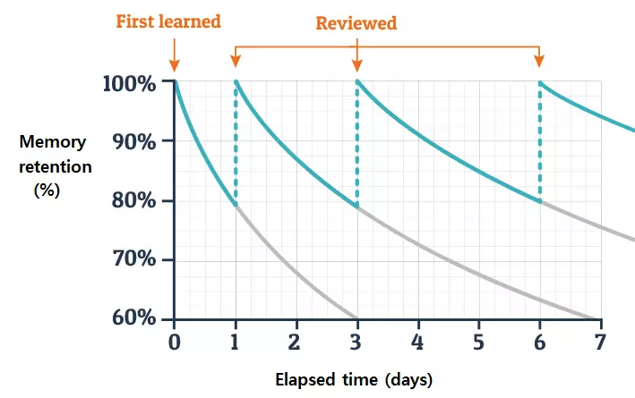
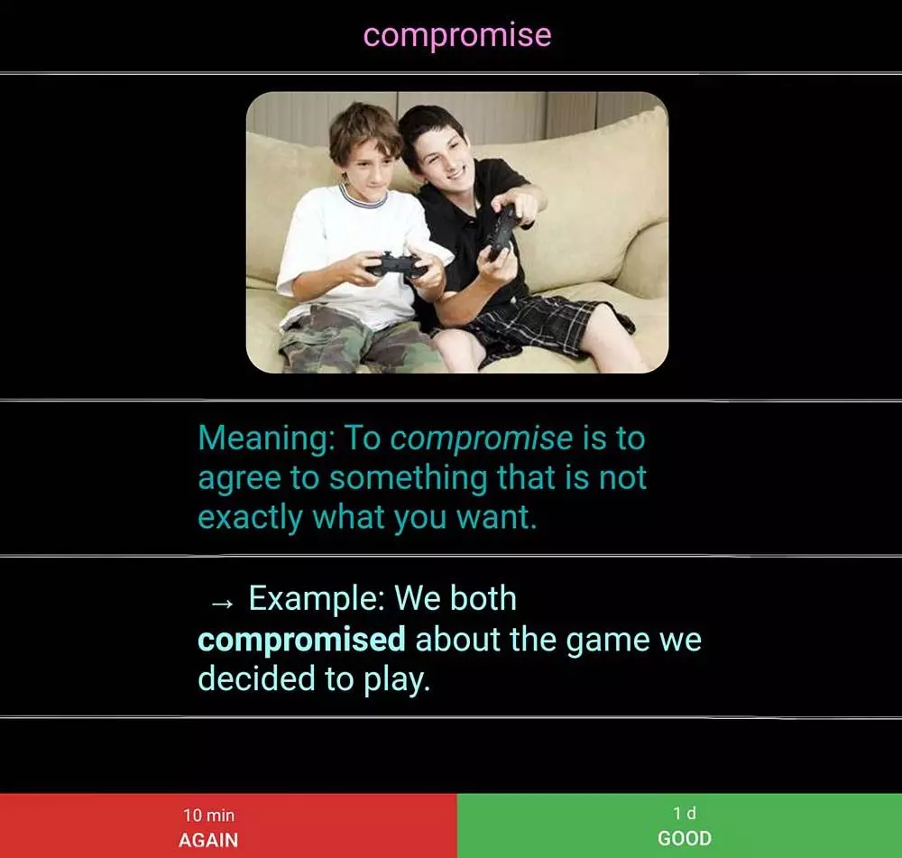

+++
date = '2021-05-01T08:49:36+03:30'
draft = false
title = 'بهترین و موثرترین روش یادگیری'
description = 'همه تا حالا از روش اشتباهی برای درس خوندن استفاده می‌کردیم! واقعا بهترین راه برای یادگیری چیه؟'
image = 'banner.webp'
+++

۱۲ سال توی مدرسه بهمون گفتن درس بخونین، ولی هیچ‌وقت بهمون یاد ندادن روش درست درس خوندن و یادگیری چطوریه. روشی که با کمترین تلاش، بیشترین بازدهی رو داشته باشه. در این پست شما با بهترین روش یادگیری که از لحاظ علمی اثبات شده آشنا میشین.

# روش‌های یادگیری سنتی که کارامد نیستند

افراد باهوشی وجود دارن که فقط با یک نگاه، همه چی رو یاد می‌گیرن و نیازی به مرور ندارن. اما اکثر افراد مثل من و خیلی‌ها چنین ویژگی رو ندارن و برای یادگیری باید تلاش زیادی کنن.

یک اصل شهودی برای یادگیری بین همه به وجود اومده که میگه، هرچی بیشتر درس بخونی، بیشتر یاد می‌گیری. طبق این اصل، روش‌های مختلفی برای درس خوندن روی کار میان.

یک نفر چند دور یک مطلب رو می‌خونه تا کامل یاد بگیره، یکی از روش هایلایت کردن استفاده می‌کنه، و دیگری یادداشت‌برداری و خلاصه کردن رو در دستور کار قرار میده. چنددور خوندن به آدم این حس رو میده که تمام تلاشش رو برای یادگیری کرده و اگه نتیجه نگرفت، خودش رو سرزنش نمیکنه. هایلایت‌کردن و یادداشت‌برداشتن هم این حس رو به آدم میده که فرد مسئولیت‌پذیری هست و از اینکه میتونه مطالب رو به زیبایی خلاصه کنه لذت میبره. اما این‌ها دلیل بر این نیستن که ما از تمام پتانسیلمون برای یادگیری استفاده کردیم.

همه این روش‌ها اثبات شدن که کارامد نیستن؛ در واقع به نحوی تاثیر خودشون رو میذارن، ولی وقت و انرژی زیادی از ما می‌گیرن. منظور از این‌که کارامد نیستن اینه که روشی وجود داره، که با صرف وقت کمتر نتیجه بهتری برای ما به ارمغان میاره.

# روش‌های یادگیری کارامد

شاید فکر کنین هرچی اطلاعات بیشتری وارد مغز بشن، بهتر یاد گرفته میشن؛ ولی تحقیقات نشون داده هرچی اطلاعات بیشتری از مغز فراخوانی بشن، بیشتر تثبیت میشن. هنگامی که چیزی رو از حافظه فراخوانی می‌کنیم، بین نورون‌های مغزی مربوط به اون اطلاعات، راه‌هایی به وجود میاد و هر دفعه که به اون اطلاعات نیاز داشته باشیم، راه های بیشتر و قوی تری به این اطلاعات ساخته میشن.

به همین دلیل اگه چیزی وارد مغزمون بشه و ازش استفاده نکنیم، رفته رفته راه های منتهی به اون از بین میره. جالبه بدونین اطلاعات سرجاشون هستن ولی مغز راه دسترسی به اون‌ها رو نداره. کسی یادش نمیاد هفته قبل شام چی خورده، چون تا حالا از این اطلاعات استفاده‌ای نکرده، ولی اگه خونه مادربزرگ شام خیلی لذیذی خورده باشه و تعریف شام رو پیش همه کرده باشه، مطمئنا همچنان یادشه چی خورده.

به خاطر همین موضوع، روشی برای یادگیری هست به نام active recall. در این روش، بعد از اینکه چیزی وارد مغزمون شد، کمی مکث می‌کنیم و اون اطلاعات رو دوباره فراخوانی می‌کنیم تا ببینیم واقعا اون مطلب رو یاد گرفتیم یا نه. این کار باعث میشه اگه چیزی یاد گرفتیم بیشتر تثبیت بشه و اگه یاد نگرفتیم برگردیم و اونو یاد بگیریم.

در یک آزمایش، دو گروه از دانش‌آموزان مسئول خوندن یک مبحث شدن. گروه اول اون درس رو ۴ دور خوندن، و گروه دوم بعد از یک دور خوندن، چندین بار اقدام به فراخوانی اون اطلاعات کردن و میزان یادگیری خودشون رو تست کردن. بعد از یک هفته آزمونی از این دو گروه گرفته شد و گروهی که از active recall استفاده کرده بود به میزان قابل توجهی نمره بهتری داشت!

جالبه بدونید که از بین تمام افراد این گروه، تقریبا همه قبل از این آزمایش عنوان کرده بودن که گروهی که ۴ دور درس رو خواهد خوند نتیجه بهتری خواهد گرفت؛ در صورتی که نتیجه به‌دست اومده با پیش‌بینی اون‌ها سازگار نبود.

در ادامه روش active recall، باید به این نکته توجه داشته باشیم که مباحث باید در طی زمان مرتبا مرور بشن. اگه مطالب رو مرور نکنیم مغز دیگه نمیتونه از اون اطلاعات استفاده کنه و وقتی که برای یادگیری صرف کردیم هدر میره.

هرمن ابینگهاوس (hermann ebbinghaus) یک روان‌شناس آلمانیه که روی حافظه تحقیقاتی رو انجام داده. ایشون منحنی فراموشی رو برای اولین بار معرفی کرد.

طبق این منحنی، مطالب باید طی زمان مرور بشن و رفته رفته میزان فاصله بین مرورها افزایش پیدا کنه. در صورتی که مرور مطالب ادامه پیدا نکنه، واضحه که اون رو فراموش می‌کنیم. به این مرور و تکرار دانسته‌ها اصطلاحا میگن space repetition.

هدف از امتحان‌های هفتگی، ماهانه و میان‌ترم هم همین هست که دانش‌آموز یا دانشجو مجبور بشه از دانسته‌هاش استفاده کنه و طبق این منحنی، مطالب از ذهن بیرون نرن.

با ترکیب active recall و space repetition به موثرترین راه برای یادگیری می‌رسیم. راهی که ممکنه در نگاه اول به ذهنمون نیاد ولی توسط تحقیقات، آزمایش‌های گوناگون و پشتوانه علمی که داره بهترین راه هست. (لینک مربوط به تحقیقات در انتهای پست اومده که می‌تونین مطالعه کنین)

# چطور این روش رو اجرا کنیم؟

به طور کلی، هر روشی که به مرور زمان، باعث میشه که شما اطلاعات رو از مغزتون استخراج کنید، بسیار مفید و موثر هست. اما به طور خاص میشه از یک سری روش ها برای پیاده سازی این موضوع استفاده کرد.

مرسوم‌ترین راه حل برای این کار استفاده از فلش‌کارت‌هاست. کارت‌هایی که در یک طرف سوال و در یک طرف جواب بر روی اون‌ها نوشته شده، و فرد با دیدن سوال، اقدام به جواب دادن می‌کنه و در نهایت پاسخ درست رو می‌بینه. فلش‌کارت‌ها به خودی خود باعث active recall میشن ولی تضمینی برای مرور مطالب وجود نداره. برای رفع این موضوع هم اقداماتی صورت گرفته که میشه به جعبه لایتنر اشاره کرد.

با اینکه فلش‌کارت‌ها گام مهم و بزرگی در عرصه یادگیری بودن و جعبه لایتنر بسیار محبوب واقع شد، ولی همواره محدودیت‌هایی وجود داشته که استفاده از اون‌ها رو سخت کرده. برای رفع سختی‌های بوجود اومده، فلش‌کارت‌های دیجیتال به وجود اومدن.

# انکی ANKI

نرم‌افزار انکی یک برنامه رایگان برای اکثر سیستم‌عامل‌هاست، که از ایده فلش‌کارت‌ها استفاده می‌کنه. انکی سوالاتی رو در اختیار خواننده قرار میده، خواننده به اون‌ها فکر می‌کنه و پاسخ رو می‌بینه. انکی active recall و space repetition رو به خوبی پیاده‌سازی کرده و ابزار بسیار خوبی برای یادگیری هست.

تفاوت انکی با فلش‌کارت‌های فیزیکی در اینه که بعد از دیدن پاسخ از کاربر سوال می‌پرسه که در چه حد تونسته به سوال پاسخ بده؛ آیا سوال راحتی بوده؟ سخت بوده؟ اصلا نتونسته جواب بده؟ این سوالات به برنامه کمک می‌کنن که این سوال رو برای مرور در آینده برنامه‌ریزی کنه. سوالی که آسون بوده برای مدت زمان دیرتری برنامه ریزی میشه.

علاوه بر این، انکی محدود به سوالات متنی نیست، و میشه از تصویر، فیلم، فرمول‌های ریاضی و تقریبا هرچیزی که فکرش رو بکنید استفاده کرد.

مزیت دیگه انکی اینه که دسته کارت‌های آماده بسیار زیادی داره. برای مثال اگر شما می‌خواین واژه‌های زبان انگلیسی رو یاد بگیرید، کافیه یک سری به سایت انکی بزنید و فلش‌کارت‌های مربوط به این زبان رو دانلود کنید. دیگه حتی برای نوشتن فلش‌کارت‌ها هم نیازی به صرف زمان ندارید و این فوق‌العادست.

انکی رو باید به طور مستمر و روزانه استفاده کنید. شاید این جمله در نگاه اول سخت و نشدنی به نظر بیاد، ولی ۱۵ الی ۳۰ دقیقه روزانه باعث میشه تسلط بی‌نظیری داشته باشین و حتی برای امتحان‌ها تلاش اضافه‌ای انجام ندین.
# سخن پایانی
هرکسی یک روشی برای درس خوندن داره، بهش عادت کرده و تقریبا همیشه از اون استفاده میکنه و نتیجه میگیره. هدف از این پست این نیست که روش درس خوندن خودتون رو کلا عوض کنین، بلکه در کنار روشی که دارین، از این روش هم استفاده کنین. یادتون نره که تنها دونستن راه و روش درست، تضمینی بر موفقیت نیست و باید از اون استفاده بشه. انکی رو نصب کنین تا طعم یادگیری بهینه رو بچشین و با علم به اینکه این روش هم وجود داره، درس بخونین.

لینک تحقیقات، مقاله‌ها و کتاب‌های مربوطه:
- [https://pubmed.ncbi.nlm.nih.gov/26173288/](https://l.vrgl.ir/r?ad=1&l=https%3A%2F%2Fpubmed.ncbi.nlm.nih.gov%2F26173288%2F&si=k4vyw72fm3zl&st=post&u=b4uqa7r8k6si&k=aTHIALtheBtrTY33ioNR%2B1MfFIHI4iBxwvvTP0ArS%2FY%3D)
- [https://www.apa.org/science/about/psa/2016/06/learning-memory](https://l.vrgl.ir/r?ad=1&l=https%3A%2F%2Fwww.apa.org%2Fscience%2Fabout%2Fpsa%2F2016%2F06%2Flearning-memory&si=k4vyw72fm3zl&st=post&u=b4uqa7r8k6si&k=ypaPWkmFyDRYyHCHMg35iUPE2rVOTJiSGpj37XeFj70%3D)
- [https://www.gwern.net/docs/spacedrepetition/1939-spitzer.pdf](https://l.vrgl.ir/r?ad=1&l=https%3A%2F%2Fwww.gwern.net%2Fdocs%2Fspacedrepetition%2F1939-spitzer.pdf&si=k4vyw72fm3zl&st=post&u=b4uqa7r8k6si&k=RyeFXueUHFmuZfq4cr79haAwMamEjDYMXHXmszgnDr8%3D)
- [https://science.sciencemag.org/content/331/6018/772.full](https://l.vrgl.ir/r?ad=1&l=https%3A%2F%2Fscience.sciencemag.org%2Fcontent%2F331%2F6018%2F772.full&si=k4vyw72fm3zl&st=post&u=b4uqa7r8k6si&k=S333jJ8EJ52uqVOqoGq7HGjQI9WE%2BY0IfmsxcYd3cdo%3D)
