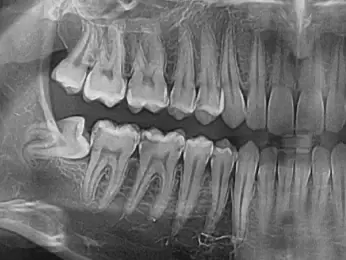
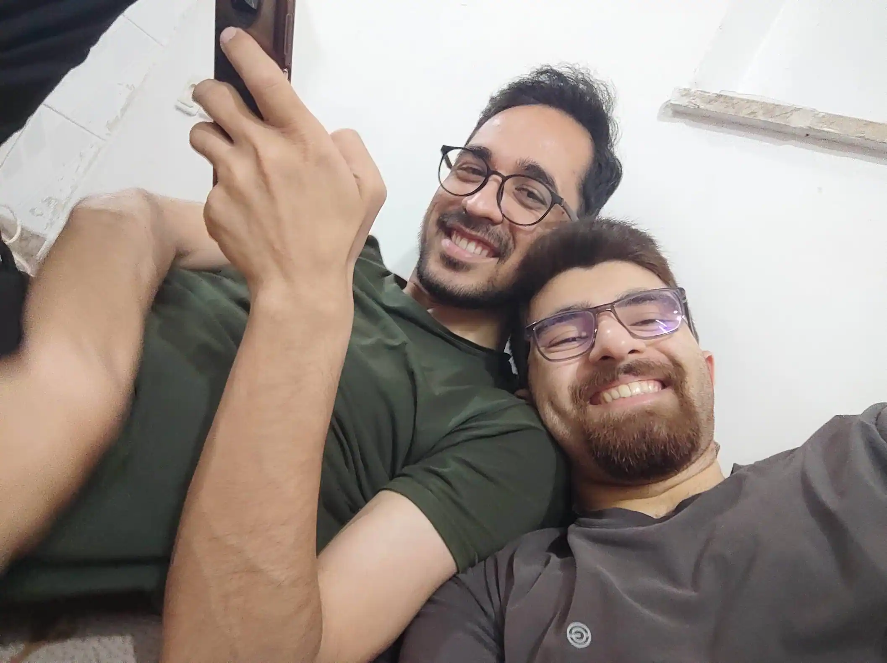
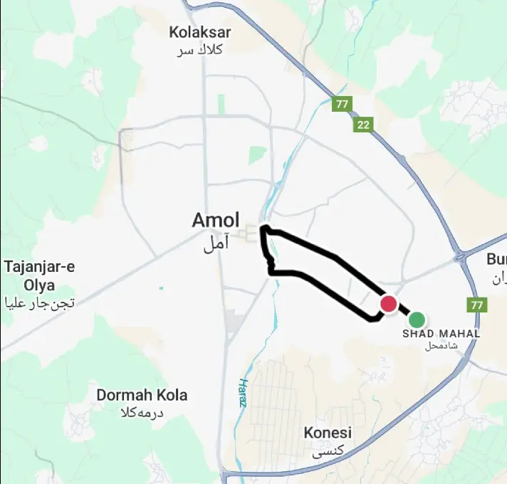
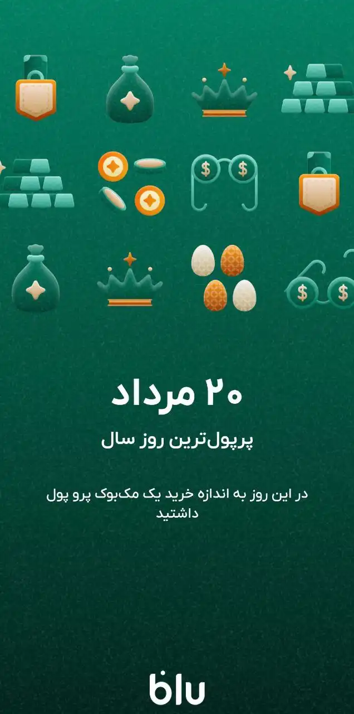
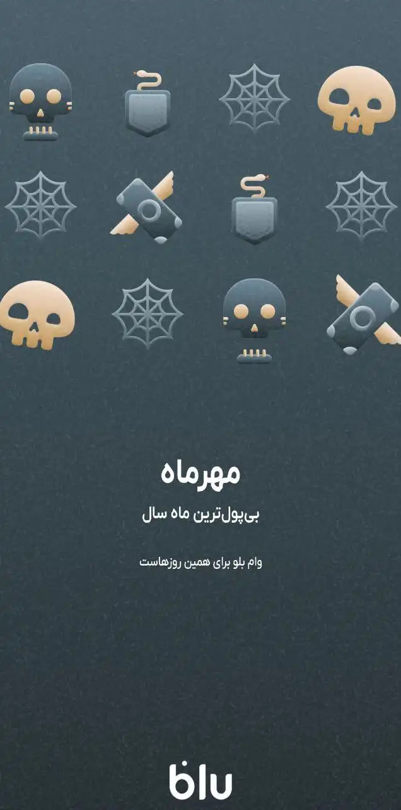
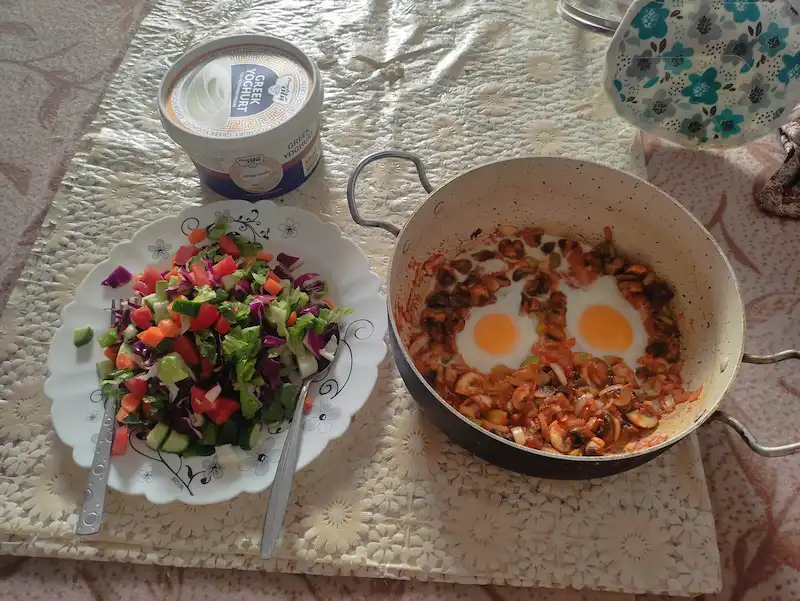
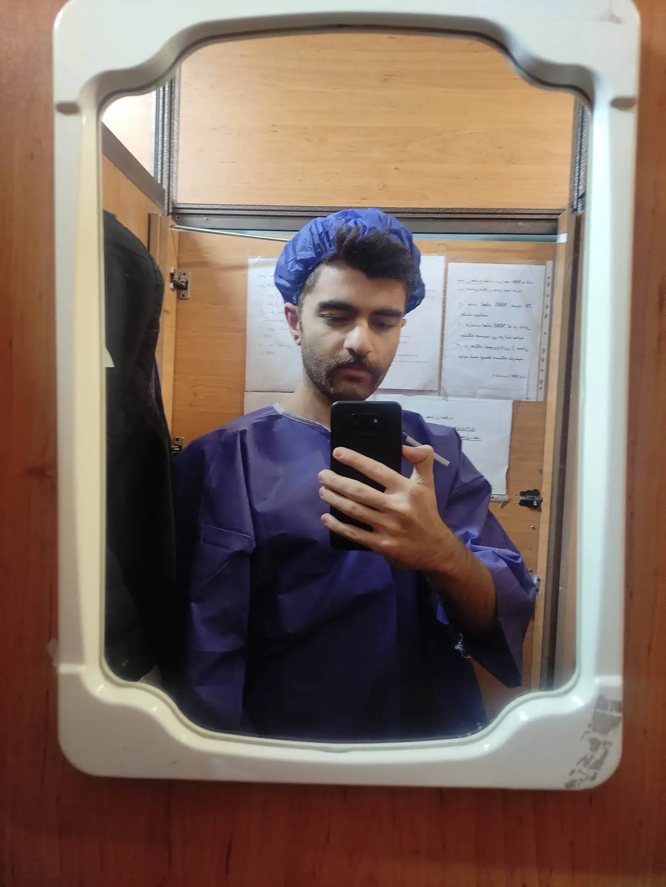
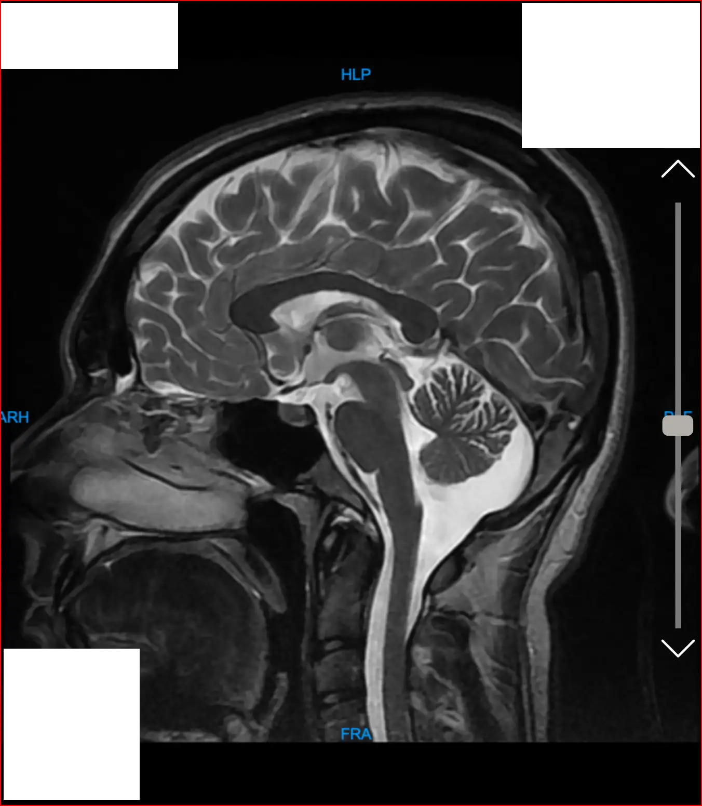
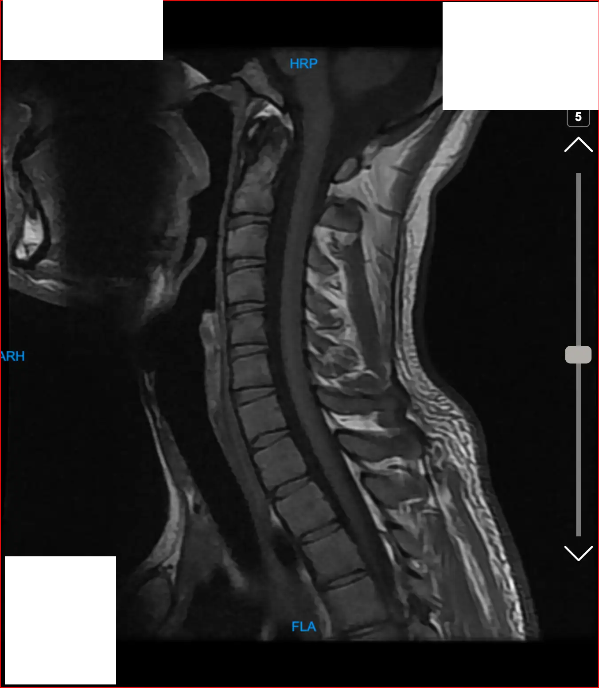

+++
date = '2025-04-01T15:02:23+03:30'
draft = true
title = 'در ۱۴۰۳ بر من چه گذشت؟'
description = 'مروری بر اتفاقات و چالش‌های مهم سال ۱۴۰۳'
categories = []
keywords = ["سالنامه ۱۴۰۳", "خاطرات شخصی", "تجربه زندگی", "یادگیری", "سفر", "دانشگاه", "پروژ کارشناسی", "مصاحبه شغلی", "کربلا", "کیش", "دویدن", "رژیم کتوژنیک", "خرید لپتاپ", "خرید موبایل", "امریه سربازی", "وبلاگ نویسی", "NotesBySMhd", "life experience", "personal story", "annual review", "university project", "job interview", "Iraq travel", "Kish Island", "running", "ketogenic diet", "MacBook Pro", "iPhone", "military exemption", "blogging", "self improvement"]
tags = ["سالنامه", "خاطرات", "زندگی شخصی", "مرور سال"]
image = 'banner.webp'
+++

# مقدمه

عجب سال پرمخاطره و عجیب و غریبی بود. این پست رو برای خودم می‌نویسم که سال‌های بعد بیام بخونم. ولی اگه تو هم دوست داری بدونی چی چی بر من گذشته، می‌تونی در این سفر با من همراه باشی.

# فصل اول: بهار کم حاشیه

بهار اتفاق زیادی برای من نیفتاد. مشغول ترم ۱۰ دانشگاه بودم. ترم سختی بود. در کنارش کار هم می‌کردم و وقتم پر میشد. در وقت باقی‌مونده با بچه‌های شرکت می‌رفتیم سالن فوتسال بازی می‌کردیم.

## مصدومیت جزئی از ناحیهٔ شست پا
همین سالن یکی از مصدومیت‌های قدیمی من رو تشدید کرد و باعث شد پیش دکتر متخصص ارتوپد برم. دکتر بعد از بررسی گفت به خاطر آسیب‌دیدگی قبلی باید چند ماهی استراحت می‌کردم. که نکردم. همین باعث شده دردش موندگار بشه.

اینجا بود که تصمیم گرفتم یه کفش فوق راحت بخرم. با یکم تحقیق، سراغ برند اسکیچرز رفتم. خیلی گرون بود. اما بعد از تقریبا یکسال از اون زمان، ۱۰۰٪ ازش راضیم. باور کن هر روز پام کردم. کوه و دریا و بیابون و محل کار پوشیدمش. آخ نگفته. تک تک ریال‌هایی که بابتش دادم حلالش باشه.

بعد از اون دیگه سالن هم نرفتم و به مرور پاهام خوب شد.

# فصل دوم: تابستان غمناک
اواسط تیرماه بود که دانشگاهم رو تمام کردم. بعد از ۱۰ ترم (۵ سال) درس خوندن بالاخره تمام شد 🫠 ترم آخر هم خیلی سنگین بود. بالاخره تونستم یه نفس راحت بکشم.
سریع به آمل برگشتم. کل تابستون رو آمل موندم.

## مصاحبهٔ غیرمنتظره
یه بابایی از چند ماه پیش هی بهم زنگ میزد و می‌گفت از مراجع رسمیه و می‌خواد ازم مصاحبه بگیره. خیلی پیگیر بود. از جیک و پوک منم خبر داشت :) به محض این که فهمید برگشتم آمل بهم دوباره زنگ زد و یه قرار تنظیم کرد تا توی ساری برای مصاحبه برم. مصاحبه‌ای که روحمم ازش خبر نداشت در مورد چیه. با این بهونه که «بیا حالا تهش قبول نمی‌کنی و چیزی از دست نمیدی» منو به ساری کشوند.

وارد سازمان برنامه و بودجهٔ استان شدم. ظاهرا افراد دیگه‌ای هم برای مصاحبه اومده بودن. همه تیپ مذهبی زده بودن و سعی می‌کردن خودشون رو حزب‌اللهی نشون بدن. خیلی هم استرس داشتن. ولی من خیلی معمولی و بدون هیچ گونه استرسی رفتم 😂

یکم منتظر موندم تا نوبتم بشه. رفتم داخل یه اتاقی و یه آقای جوونی اونجا نشسته بود. خیلی خوش برخورد و مرموز بود. از ریز و درشت زندگی من سوال پرسید. منم با صداقت به همهٔ سوالات جواب دادم. خیلی از سوالاتش رو هم بلد نبودم. اکثرا سوالات سیاسی و مذهبی بودن. حتی مقدار زیادی از سوالاتش شخصی بودن. مطمئنم جواب همهٔ این سوالات شخصی رو می‌دونستن و این سوالات برای راستی‌آزمایی بوده.

در نهایت بهم پیشنهادهایی داد. کارهای دولتی بودن. مزایا و معایبی داشتن. از گفتن جزئیات این پیشنهادها معذورم چون ممکنه بعدا گیر بدن بهم 😂 ولی قبول نکردم و با یه «نه» اونجا رو ترک کردم.

## سفر به عراق

من اصلا آدم مذهبی‌ای نیستم. اما در خانواده‌ای مذهبی بزرگ شدم. مادر و پدرم بهم پیشنهاد دادن که با هم دیگه به کربلا بریم. برای همراهی با اونا با کله قبول کردم.

آخرین روز تیرماه بود که به نجف پرواز کردیم. عصر اون روز به حرم امام علی رفتیم و زیارت کردیم. شب برگشتیم به خونه و خواهرم تماس گرفت. خبر داد که دختر خالم فوت کرده :(

## فوت دخترخاله

وای نگم براتون که چقدر این خبر دردناک بود. دخترخالم تصادف کرده بود و چند وقتی میشد که به کما رفته بود. قبل از این که به عراق بریم، بهمون گفتن که حالش رو به بهبوده. اما همون شبی که رفتیم نجف خبر مرگش بهمون رسید. مادرم داشت دیوانه میشد. نمی‌تونست خودش رو آروم کنه. توی مملکت غریب خیلی سخته.

جوری حالمون داغون شده بود که فی‌الفور یه بلیط برگشت تهیه کردیم. فردا، یعنی یک روز بعد از این که رفته بودیم به عراق، برگشتیم ایران. مستقیم به خونهٔ خالم رفتیم. انقدر فضا دلگیر و ناراحت‌کننده بود که نمی‌تونم توصیفش کنم.

## رسیدگی به دندان‌ها

تابستون رو زمان مناسبی دیدم که به دندون‌هام برسم. شاید باورش سخت باشه، اما حتی یک بار هم تا اون زمان به دندون‌پزشکی نرفته بودم. یکم به این موضوع افتخار می‌کردم. ولی الان می‌دونم که چقدر احمق بودم.

دکتر بعد از این که عکس گرفت، فهمید خیلی از دندون‌هام پوسیده شدن. یه دندون عقل داشتم که نیاز به جراحی داشت. دو تا هم به عصب رسیده بودن. اوضاع بس ناجوانمردانه بد بود.‍‍

تمام دندون‌هام رو سرویس کردم. مسیر دردناک و پرهزینه‌ای بود و در این راه من خون‌ها دادم 😭

## پروژهٔ کارشناسی

دروس دانشگاه تمام شده بودن، به جز پروژهٔ کارشناسی که غول آخر بود.
با استاد نوری بایگی این درس رو برداشته بودم. چندین بار رفتم پیشش تا بهم یه پروژهٔ درست و حسابی بده. یکی دو بار حتی پروژه بهم داده شد اما کنسل شد.
در نهایت، بهم یه پروژه دادن که اپلیکیشن موبایل بسازم تا کنفرانس‌های دانشگاه رو باهاش مدیریت کنن. به عبارتی توی اون اپ کنفرانس‌های جدید ساخته بشن، افراد ثبت نام کنن، به شرکت‌کنندگان اطلاع‌رسانی بشه و در نهایت حضور و غیاب انجام بشه.

صد خودم رو روی این پروژه نذاشتم متاسفانه. تعلل می‌کردم و دل به کار نمی‌دادم. تنها انگیزه‌ام برای تمام کردنش گرفتن نمره بود و بس. اولش ذوق داشتم. اما هرچی جلوتر رفتم دیدم چقدر Backend محوره و اپ موبایلش خیلی ساده هست.

برای راحتی بیشتر از Supabase استفاده کردم. اپش رو هم خیلی ساده و ناقص زدم. در نهایت همین اپ ناقص رو تحویل دادم. کد این پروژه توی حساب گیتهابم با نام ConfMan موجوده.

# فصل سوم: پر از ماجرا

پاییز برای من خیلی عزیزه. نه تنها فصلیه که توش به دنیا اومدم، بلکه هر ساله بهترین عملکردم رو توی این فصل دارم. پر از حس خوب و دستاورد برام بوده و هست.

## هم‌خونه شدن با سجاد رودی، دوباره

سرنوشت من و آقای رودی رو به هم پیوند زده. این بشر از وقتی اومدم دانشگاه باهام بوده. با هم توی دانشگاه هم‌اتاقی بودیم، هم‌کلاسی بودیم، موقع کرونا مجدد با هم هم‌اتاقی شدیم و حتی با هم همکار هم شدیم. طوری که هر روز از صبح که می‌رفتم سلف، تا موقع کار که میزش جلوی من بود، تا شب موقع شام درست کردن کنار هم بودیم.

دانشگاه تمام شد من دیگه خوابگاه نمی‌رفتم. اونم محل کارش رو عوض کرد و دیگه همکار نبودیم. اما این بار با هم‌خونه شدن بازم ارتباطمون تمدید شد :)

## از سرگیری دویدن

من از چند سال پیش عاشق دویدن شدم. اما به دلایلی کنار گذاشته بودمش. واقعا وقت نداشتم. حالا فرصت مناسبی بود که دوباره شروع کنم. چقدر خوب هم شروع کردم.

از اپ Just Run رسیدم به اپ Adidas Running. یک دوره برای مبتدی‌ها داشت که اون‌ها رو به سطح 5K می‌رسوند. اونو قبل از آخر سال تمام کردم و رفتم سراغ دورهٔ بعدی که برای 10K بود.

من توی سال ۱۴۰۳ در مجموع ۱۷۰ کیلومتر دویدم. یعنی اگه یه سره می‌رفتم، می‌تونستم از مشهد برم نیشابور و دوباره برگردم. برای درک این میزان، جالبه این عکس رو ببینید.

## خرید لپتاپ جدید

مردادماه بود که تصمیم بزرگی گرفتم. دفترم رو باز کردم. شروع کردم به نوشتن. اونجا نوشتم که من می‌خوام یه لپتاپ جدید بخرم. یه لپتاپ خفن. یکم جستجو کردم. در نهایت یه لیست تهیه کردم. بالای این لیست اسم MacBook Pro M3 دیده میشد. لپتاپی که اون زمان که داشتم می‌نوشتم واقعا خریدش دور از ذهن بود.

اما چند ماه بعد در آبان ماه من لپتاپ مورد نظر رو خریدم. ۱۰۰ میلیون تومن ناقابل برام آب خورد. خیلی تصمیم عجیبی بود. به هرکسی می‌گفتم بهم می‌گفت تو دیوونه‌ای. اما من هدف داشتم و این حرکتم بی‌فکر نبود.

حالا این دو تا عکس از بلوبانک رو هم داشته باشین خیلی جالبه 😂

 

## شروع رژیم عجیب و غریب

یه موضوعی پیش اومد که من واقعا از بدنم شرمسار شدم. مخصوصا از ناحیهٔ چربی‌های شکمی از خودم بدم میومد. اولش خواستم برم باشگاه ولی بعد از کمی تحقیق متوجه شدم آب کردن چربی بیشتر از طریق رژیم اتفاق میفته.

توی یوتیوب با یه دکتری آشنا شدم که ۱۲ میلیون دنبال‌کننده داشت. حرفای ساده و منطقی میزد. کلی کامنت خوندم. همه راضی بودن و جواب گرفته بودن. هنوزم برام سواله که چطوری انقدر یه اکانت عالی برای خودش ساخته.

اینطوری شد که من رژیم کتوژنیک رو شروع کردم. خوردن هر گونه قند و کربوهیدرات ممنوع شد. یهو مصرف چربیم رفت بالا. در کنار این رژیم سخت، فستینگ هم شروع کردم. صرفا ناهار و شام می‌خوردم و برای صبحانه هم سعی می‌کردم چیزی نخورم.

الان که دارم به اون زمان فکر می‌کنم واقعا برگی برام نمی‌مونه. چطوری این حالت رو برای چند ماه تونستم ادامه بدم؟ خیلی سخت و طاقت‌فرسا هست. الله اکبر از این اراده.

این رژیم بدی‌های بسیار زیادی برای من داشت. اما خیلی ازش یاد گرفتم. مثلا حداقلی ترین مزیتش این بود که مجبور شدم آشپزی کنم.

## سفر به کیش

یه روز خواهرم باهام تماس گرفت. بهم گفت اگه ما بخوایم بریم کیش باهامون میای؟ گفتم آره. همین قدر ساده. رفتیم کیش.

من از مشهد با ماشین به آمل رفتم. بعد بلافاصله روز بعدش با هم به تهران رفتیم. توی مسیر برف و کولاک بود. خدا رو شکر که بلیط رفتمون همون روز بود. چون روزهای بعد مسیر هراز به خاطر برف کلا بسته شده بود. سوار بر هواپیما شدیم و زمانی که هوا تاریک شده بود به کیش رسیدیم.

خیلی اون دو روز خاص و عجیب بود. تصور کن از این شهرها گذشتم:

مشهد​ - چناران - قوچان - فاروج - شیروان - بجنورد - آشخانه - تنگراه - کالگیش - مینودشت - آزادشهر - دلند - خان‌بین - گرگان - کردکوی​ - بندرگز​ - گلوگاه - بهشهر - نکا​​ - ساری - قائم‌شهر - بابل - آمل - رودهن - بومهن - تهران - کیش

همه جور آب و هوا از جمله آفتابی، باد شدید و گرد و خاک، بارانی، برفی و کولاک رو هم دیدم. همش زیر ۴۸ ساعت! محشر بود.

از کیش هم که براتون نگم. اولین تجربه‌ام بود. لذت بردم. خیلی جاها رفتیم. خیلی کارا کردیم. اما بیشتر از همه می‌دونی چی بهم چسبید و الان توی خاطرم هست؟ آرامش، سکوت، خلوت، تنهایی، لب ساحل و غروب آفتاب.

# فصل چهارم: زمستانی افسرده

اگه بخوام فصل‌ها رو رتبه‌بندی کنم قطعا زمستون پایین‌ترین جایگاه رو می‌گیره. اصلا ازش خوشم نمیاد. افسرده و بی‌روح میشم.

امسال اولین سالی بود که خدا خدا می‌کردم فقط زمستونش تمام بشه. در ادامه متوجه میشی چرا.

## تجربهٔ کوری موقت

طبق عادت رفته بودم پارک ملت. شروع کردم به دویدن. اما با دفعات قبلی تفاوت داشت. اون روز خیلی خسته بودم. اصلا حال دویدن نداشتم. ولی به خاطر این که برنامه‌ریزیم خراب نشه جا نزدم.

حدودا نصف مسیر رو دویدم و دیدم نه، امروز روز من نیست. بیخیال شدم. پیاده در حال برگشت به سمت ماشین بودم که یهو یه نور سفیدی در وسط افق دیدم ایجاد شد. اولش خیلی جزئی بود ولی با یه ریتم ثابتی داشت بزرگ و پرنورتر میشد.

ترسیدم. نمی‌دونستم چه خبره. سریع رفتم روی یه نیمکت نشستم مبادا غش کنم. چشمام رو بستم و شروع کردم به نفس عمیق کشیدن، به این امید که موقتیه و چند ثانیه بعد تمام میشه. یکم صبر کردم. یهو جا خوردم!

حتی زمانی که چشمام بسته بودن همون نور سفید رو می‌دیدم. یه جای کار بدجوری می‌لنگید. ضربان قلبم رفت بالا و استرس شدیدی گرفتم. چشمام رو باز کردم و سریع با همون وضعیت داغون به سمت یک کیوسک رفتم. ازش یه چای و خرما گرفتم. کارت بانکی همراهم نبود، باید کارت به کارت می‌کردم. با چه بدبختی با گوشیم کار کردم و پرداخت رو انجام دادم.

این بخش سفید به شکل یک بیضی بادام‌شکل، دقیقا اندازهٔ تخم چشمام در اومدن. کاملا هم سفید شدن و جلوی دیدم رو گرفتن. خوشبختانه با خوردن چای و خرما به مرور تاثیرش کمتر شد و بعد ۵ دقیقه خوب شدم.

## دستم عصبانی شد

پنجشنبه بود. باز هم یه روز دویدن دیگه. این بار مثل دفعهٔ قبل نبود. برام درس بزرگی شده بود که زمانی که حالش رو ندارم به زور ورزش نکنم. قبل دویدن هم کلی به خودم می‌رسیدم و کامل شارژ می‌شدم.

خیلی سخت بود ولی با موفقیت تونستم ۷ کیلومتر رو یه سره بدوم. رکوردم رو شکسته بودم. خیلی شاد و خوشحال به خونه برگشتم. چند ساعت گذشت و یهو دستم درد گرفت. درد عجیبی بود. مشخص بود از عضله و اسکلت نیست، عصبیه.

تعجب کرده بودم. نه شب قبل بد خوابیده بودم، نه جایی بهش ضربه زده بودم. شاید به خاطر فشاری بود که به بدنم آورده بودم؟ نمی‌دونم. یکم اون شب تلاش کردم با آب داغ و مسکن دردش رو کم کنم. با همین وضع خوابیدم. صبح که بیدار شدم وضع افتضاح بود. نمی‌تونستم دستم رو از آرنج کامل باز کنم. اونقدر دردش شدید بود که با بازکردن دستم فریاد می‌زدم.

رفتم پیش یه دکتر و منو فرستاد تا از دستم یه نوار گرفته بشه. فرایند عجیبی داشت. اینجا جاش نیست که بگم چطوری گذشت. نتیجه رو به دکتر نشون دادم و گفت مشکل به گردنم مربوط میشه. یا خدا. گردن چطوری وارد این بازی شده بود؟ 😂

قرار بود با یه مقدار دارو و دوا مشکلم حل بشه...

## دستم خوابید

به مرور دستم داشت بهتر میشد. ولی کم کم سر و کلهٔ درد گردن داشت شروع میشد. دکتر راست می‌گفت.

یه روز که طبق معمول رفته بودم سرکار متوجه شدم با نشستن طولانی انتهای انگشتام به خواب میرن. خیلی ترسیدم. نکنه یه مشکلی توی نخاع و ستون فقراتم به وجود اومده بود؟ شنیده بودم مشکلات عصبی این شکلی خوب نمیشن.

سریع یه نوبت از دکتر مغز و اعصاب گرفتم. بهم گفت MRI بگیرم. یه بار از گردن، یه بار هم از مغزم. هیچ ایده‌ای از MRI نداشتم. روز عکس‌برداری رسید. منتظر بودم نوبتم بشه. کلی آدم اونجا منتظر بودن.

نسبت به خودم ناراحت شده بودم. همهٔ آدمای اونجا پیر و لب گور بودن. هرکی منو می‌دید فرض می‌کرد من همراه یه مریضم. اما خودم مریض بودم 😂 این که هیچ کسی هم از این که دارم MRI می‌گیرم باخبر نبود هم ناراحت‌کننده بود.

خلاصه با یه معطلی زیاد نوبتم شد. بهم یه لباس خاص دادن. مثل این که خیلی عوارض داشت. چون دیوارها و در قطوری برای دستگاه گذاشته بودن و نزدیک فرایند عکس‌برداری که میشد همه فرار می‌کردن :)

تجربهٔ جالبی بود. به صورت افقی ما رو داخل دستگاه می‌فرستادن. بعدش دیگه تا حدود ۲۰ دقیقه نباید تکون می‌خوردی. خیلی دستگاه پر سر و صدایی بود. صداهاش ریتم داشتن. یه جاهایی صداش شبیه به بازی‌های آتاری میشد. یه جاهاییش شبیه به تیراندازی میشد. بعضی جاها تصور می‌کردم کسی از بیرون داره در می‌زنه 😂

گذشت. جواب MRI اومد. خیلی عکس‌های ترسناکی بود :/ تصور این که این عکس‌ها مغز من بودن یه جوری بود. نتیجه رو پیش دکتر بردم و گفت مشکلی نداری و جای نگرانی نیست. با مصرف دارو مشکل حل میشه.

 

## راه‌اندازی NotesBySMhd.ir

زمان زیادی میشد دلم می‌خواست یک جایی باشه که بتونم بنویسم. قبلا ویرگول رو انتخاب کرده بودم ولی همیشه با این که نوشته‌هام در انحصار و زیر نظر یکی دیگه باشن بدم میومد. جدا از حس بدش محدودکننده هم بود. اینطوری شد که تصمیم گرفتم یه جای شخصی راه‌اندازی کنم.

اولش دامنهٔ smhd.ir رو می‌خواستم. اما در دسترس نبود. همون اولش با خودم گفتم نیازی نیست این همه سر انتخاب دامنه وقت بذارم. الان اولویت داشتن اسم مناسب نیست. اولین چیزی که به ذهنم رسید یعنی NotesBySMhd رو انتخاب کردم و دامنه‌اش رو خریدم.

تجربهٔ راه‌اندازی وبلاگ شخصی نداشتم. جستجو کردم و با مشورت با دوستان تصمیم گرفتم از ابزار Hugo استفاده کنم. چند روزی روش وقت گذاشتم و خیلی سریع تونستم بالا بیارمش. ازش راضیم. هزینهٔ خاصی برام نداره و کارم رو داره راه می‌اندازه. انتشار مطالب جدید هم خیلی ساده هست. حتی از ویرگول هم ساده‌تره.

در یک افق بلندمدت، انتظار دارم نوشته‌های بسیار بیشتری اینجا منتشر کنم. چه بسا روزی برسه که هر روز پست جدیدی بذارم.

## درخواست امریه

امریه یک طرح جایگزین برای خدمت سربازیه که اجازه میده به جای رفتن به سربازی، به مدت دو سال توی یک شرکت دانش‌بنیان کار کنیم. طرح جذابیه. منم از قدیم چشمم به این طرح بود. بالاخره نوبت من رسید و اینجا بود که درخواست اولم رو ارسال کردم.

البته به همین راحتی هم نبود. یه سری مسائل پیش اومد که نزدیک بود کلا امکان ارسال درخواست رو نداشته باشم. همین قضیه خیلی بهم استرس وارد کرد. اعصابم خورد شده بود. چند سال بود که براش تلاش کرده بودم و در نهایت داشتم از کف می‌دادم.

خلاصه هرجوری که بود درخواستم رو ارسال کردم. در کمال تعجب درخواستم رد شد :) چیزی که اصلا فکرش رو هم نمی‌کردم. با توجه به نتایج ماه‌های قبل، احتمال قبولی من بسیار بالا بود. اما نشد. این موضوع هم ضربهٔ بزرگی به آرامش و روانم وارد کرد. مخصوصا این که من بیشترین امتیاز ممکن رو داشتم و برای این که امتیازم رو افزایش می‌دادم، یا باید ارشد می‌خوندم یا ازدواج می‌کردم. که جفتش شدنی نبود.

البته برای ارشد خوندن یه امید کوچیکی داشتم. پذیرش در طرح استعدادهای درخشان دانشگاه آزاد. اما باید تا خرداد منتظر می‌موندم تا ببینم شرایط این طرح چطوریه.

## خرید موبایل جدید

گوشیم اون زمان Poco X3 بود. چند سالی میشد ازش استفاده کرده بودم. اذیت کردنش شروع شده بود. مخصوصا از ناحیهٔ ۶۴ گیگی بودنش. کرش‌ها و باگ‌های گاه و بی‌گاه هم بهش اضافه شده بود. برای همین تصمیم گرفتم گوشی جدید بخرم.

برای ماه‌ها دنبال گوشی خوب گشتم. سه تا گوشی Samsung و iPhone و Nothing زیر ذره‌بینم بودن. از سامسونگ خوشم نمیومد. iPhone هم خیلی گرون بود. می‌موند Nothing. اما از آخرین گوشی که منتشر کرده بود مدت زیادی می‌گذشت. تمام گوشی‌هاش تا اون زمان میان‌رده بودن. یه نیم‌نگاهی به پرچم‌دار Nothing هم داشتم که وجود نداشت.

طبق همین قضیه قرار بود چند ماهی صبر کنم تا محصول جدید Nothing رو ببینم و تصمیم نهایی رو بگیرم. اما یهو همه چی عوض شد. خیلی سریع تصمیم گرفتم iPhone بخرم. هم چون فکر می‌کردم سال جدید قیمتش سر به فلک می‌کشه، هم به خاطر توصیهٔ کسی که به شدت قبولش دارم و در نهایت به خاطر این که معتقدم آدم باید همیشه پرچمدار بخره. حتی اگه پولش نمی‌رسه پرچمدار سال‌های گذشته رو بخره بهتره.

آره خلاصه. یهو دیدم دستم iPhone افتاده. تفاوت بزرگی بود. همه چی متفاوت بود. چند ماه طول کشید تا بهش عادت کنم. اما در کل راضیم. مزایاش به معایبش می‌چربه.

## چالش صد روز یادگیری

زمانی که حالم خوب نیست، حوصله ندارم، اعصابم خورده یا کلا از لحاظ فکری در شرایط پایداری قرار ندارم استفاده از فضای مجازیم به اوج می‌رسه. چون یکم کارم خوبه بازخورد خوبی هم می‌گیرم. اینطوری بیشتر تشویق به ادامه میشم. اعتیاد نتیجهٔ این فراینده.

آخرای سال از شبکهٔ اجتماعی «ویراستی» خیلی استفاده می‌کردم. اما انقدر مطالبش بی‌خود بود حالم دیگه داشت به هم می‌خورد. هیچکس مطلب مفیدی نمی‌ذاشت. حس کردم یکی باید این کار رو بکنه. جوگیر شدم و اعلام کردم می‌خوام چالش جدیدی راه بندازم که صد روز یه پست آموزنده بفرستم، هرکی پایه هست بسم‌الله.

میگن آدمو برق بگیره ولی جو نگیره راست میگن. آخه این چه ادعای بزرگی بود مرد 😂 صد روز خیلی زیاده. هیچکسی هم چالش رو شروع نکرد. تنها ماندم. اما حرف زده بودم. باید ادامه می‌دادم.

از این لحاظ که هر روز مجبور می‌شدم راجع به یه چیزی تحقیق کنم راضیم. باعث شد عادت خوبی در خودم بسازم.

# پایان

وای چقدر طولانی شد :)

خیلی خوشحالم تونستم هرجوری که شده یه رد از کارهایی که انجام می‌دم باقی بذارم. انتهای سال میشه بریم سراغ این ردها و مرور کنیم چه بر سر ما گذشته. قبل از نوشتن این سالنامه فکر می‌کردم امسال کار خاصی انجام ندادم. اما الان که نگاه می‌کنم اینطوری نبوده.

ممنونم از Todo list و Calendar عزیزم که این مسیر رو برام روشن کردن 😂 همچنین از تو که وقت گذاشتی و مطالعه کردی. کاش باب بشه هرکسی سالنامهٔ خودش رو بنویسه و برای سال آینده این دفعه من پست شما رو بخونم.

یکم سال آینده به نظرم ترسناکه. آیندهٔ مبهمی در پیشه. ۱۴۰۳ سال جالبی نبود. اما ته دلم می‌گه ۱۴۰۴ بدتر نباشه بهتر نیست. خدا به خیر بگذرونه.