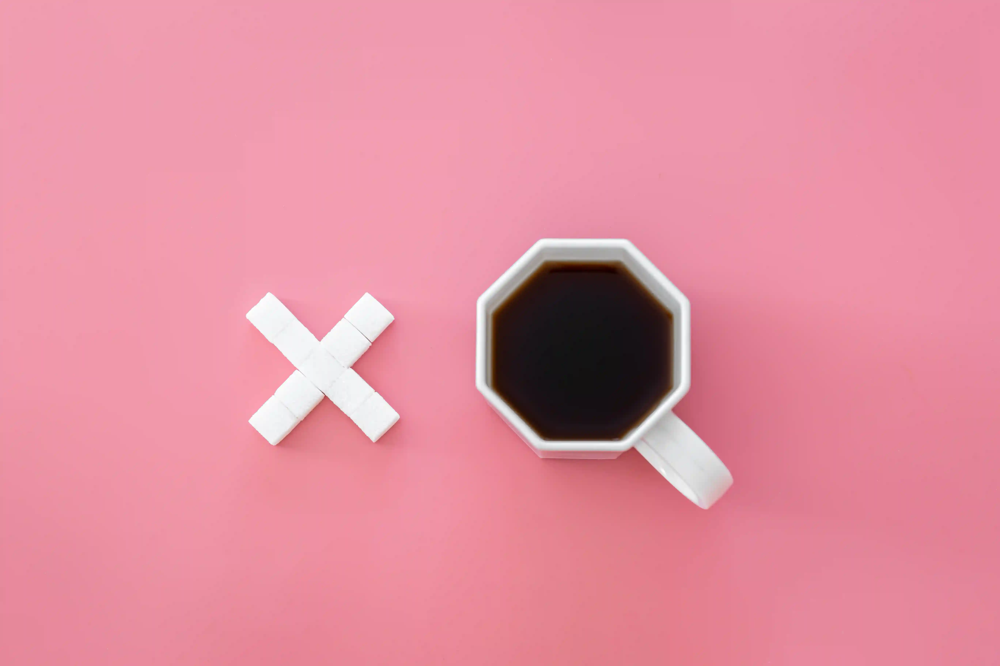
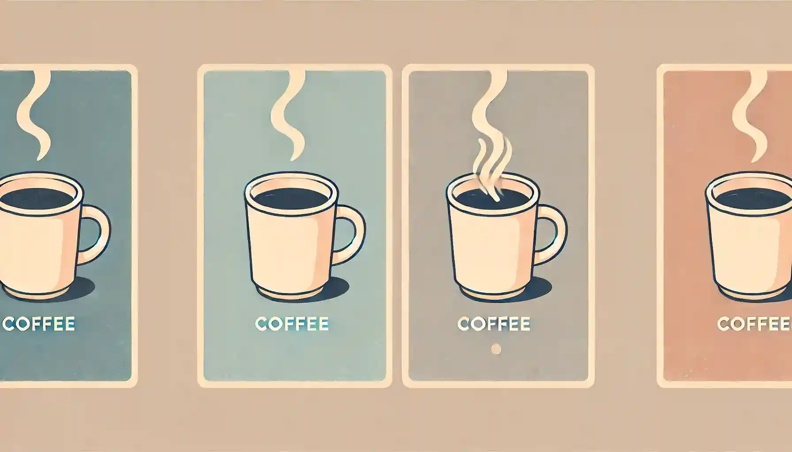
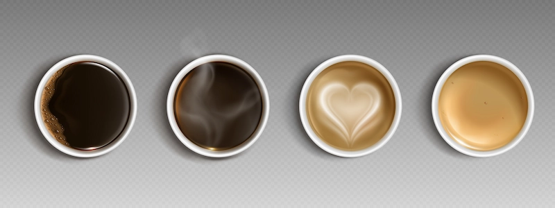

+++
date = '2025-03-05T23:06:30+03:30'
draft = false
title = 'چرا قهوه دیگر مثل روز اول اثر ندارد؟'
description = 'بعد از یه مدت، قهوه تأثیرش رو از دست میده. چرا این اتفاق می افته و چطوری میشه دوباره مثل روزای اول حسش کرد؟ تو این پست جوابش رو پیدا می کنی! 🚀'
categories = ["tutorial", "health"]
keywords = ["قهوه", "کافئین", "اعتیاد به قهوه", "تاثیر کافئین", "خواب", "تمرکز", "انرژی", "عادت", "دوپامین", "ریست کافئین", "قهوه دوپامین", "قهوه و خواب", "قهوه و بدن", "قهوه و تمرکز", "قهوه و انرژی", "اثر کافئین", "چگونه قهوه بخوریم", "بهترین زمان نوشیدن قهوه"]
tags = ["قهوه", "کافئین", "اعتیاد به قهوه", "تاثیر کافئین", "خواب", "تمرکز", "انرژی", "عادت", "دوپامین", "ریست کافئین", "قهوه دوپامین", "قهوه و خواب", "قهوه و بدن", "قهوه و تمرکز", "قهوه و انرژی", "اثر کافئین", "چگونه قهوه بخوریم", "بهترین زمان نوشیدن قهوه"]
image = 'banner.webp'
+++

قهوه واقعا شاهکاره. دیدی وقتی یه کوچولو از این مایع تیره‌رنگ رو وارد بدنت می‌کنی، بعد یه مدت خیلی کوتاه انگار جادویی اتفاق میفته. تغییرات رو می‌تونی حس کنی. انگار بهت انرژی میده. فرکانس کاری مغزت میره بالا. سرحال و قبراق میشی. انگیزه می‌گیری. غصه‌هات رو فراموش می‌کنی. تمرکزت بیشتر میشه.

روز بعد میگی به به دیگه راز موفقیت رو پیدا کردم! قهوه دوای دردمه. بازم قهوه می‌خوری. هممم. بازم انرژی و تمرکز و حال خوب.

روز بعد هم این کار رو انجام میدی. اما دیگه حسی که بهت منتقل می‌کنه مثل روز اولش نیست. انگار یه چیزی کمه.
ناامید نمیشی. میگی شاید قهوش درست آماده نشده بود. دوز روبوستا رو می‌بری بالا و حس دوست‌داشتنی رو دوباره تجربه می‌کنی.

اما نه. اینم تکراری میشه. یهو می‌بینی به جایی رسیدی که قهوه می‌خوری ولی بیشتر خوابت می‌گیره!
ای بابا. جریان چیه؟

اینجا می‌خوام از تجربیاتم بهت بگم. در نهایت بهت راه حلی معرفی می‌کنم که دیگه قهوه برات تکراری نشه.

## چه وقتایی نباید قهوه بخوریم؟

### بعد از ظهر به بعد

اگه از روزت گذشته و غروب شده دیگه سراغ قهوه نرو. قهوه باعث میشه عملکرد طبیعی مغز، مخصوصا هورمون ملاتونین مختل بشه. همین باعث میشه خواب خوبی نداشته باشی.
نیمهٔ عمر قهوه در بدن حدود ۵ الی ۶ ساعته. یعنی اگه ساعت ۴ عصر قهوه بخوری، تا ساعت ۱۱ شب هنوز نصف قهوه توی بدنت هست!

الان که دارم این متن رو می‌نویسم ساعت ۱۲ شبه. معمولا ۱۱ می‌خوابم. اما چون ساعت ۵ قهوه خوردم اصلا خوابم نمیاد :)

### بلافاصله بعد از بیداری

قهوه باعث بالا رفتن هورمون کورتیزول میشه. این هورمون موقع استرس ترشح میشه. اون حس تشویشی که موقع خوردن قهوه بهت دست میده به خاطر همین هورمونه.

معمولا بعد از بیداری میزان این هورمون در بدن به پیک خودش می‌رسه. پس اگه اون زمان قهوه بخوری، افزایش کورتیزولی رو حس نمی‌کنی چون در حالت بیشینهٔ خودش هست.

قهوه خوردن توی این زمان بد نیست، اما فایدهٔ کمتری داره. پس بهتره که حداقل یک ساعت بعد بیداری صبر کنی تا این کورتیزول طبیعی بدنت کاهش پیدا کنه.

## حالا چرا این حس خوب به مرور کمرنگ‌تر میشه؟

اگه حوصله نداری این بخش رو کامل بخونی، اینطوری بگم که بدن عادت می‌کنه. اما اگه واقعا می‌خوای ریز بشی بیا ادامه رو بخون.

### مغز به مرور آدنوزین بیشتری ترشح می‌کنه

آدنوزین یک انتقال‌دهندهٔ عصبیه که در طول روز جمع میشه و باعث میشه حس خستگی و خواب‌آلودگی داشته باشیم. کافئین خیلی سریع توی گیرنده‌های آدنوزین جا خوش می‌کنه. آدنوزین دیگه به گیرنده‌هاش نمی‌رسه. اینطوریه که ما خستگی رو دیگه حس نمی‌کنیم.

اما به مرور، مغز می‌بینه هی آدنوزین تولید می‌کنه ولی بدن به یه ورشم نیست :) اعصابش خورد میشه و ترشح آدنوزین رو بیشتر می‌کنه. به همین دلیله که هرچی می‌گذره ما نیاز به کافئین بیشتری داریم تا با این آدنوزین‌های اضافه مبارزه کنه.

### حساسیت ما به دوپامین کمتر میشه

کافئین بدن ما رو تحریک می‌کنه تا دوپامین ترشح بشه. دوپامین خیلی خفنه. به قول خارجیا، این هورمون باعث Drive ما میشه. ترجمش میشه پیشران فکر کنم. انگیزه و حس خوبی که بعد قهوه خوردن داریم به خاطر دوپامینه.
اگه قهوه رو به طور همیشگی مصرف کنیم مغز حساسیت گیرنده‌های دوپامین رو کاهش میده. اینطوری دیگه کمتر به دوپامین ترشح‌شده واکنش نشون میدیم و قهوه برامون «عادی» میشه.

### کافئین زودتر هضم میشه

هرچی بیشتر کافئین به بدن برسه، معده آنزیم مرتبط با هضم کافئین رو بیشتر تولید می‌کنه. این کار باعث میشه کافئین زودتر تجزیه و هضم بشه و تاثیری که قبلا داشتیم کمتر حس بشه. یعنی هرچی بیشتر قهوه مصرف کنیم، تاثیرش کوتاه‌تر میشه.

## چیکار کنیم قهوه مثل روز اولش بشه؟

### یه مدت قهوه رو بذار کنار

به بدنت فرصت بده. ۳ تا ۷ روز اصلا لب به قهوه نزن. این کار باعث میشه بدنت Reset بشه. بعدش اگه بخوری دوباره قهوه حس فوق‌العاده‌ای که ازش به یاد داشتی رو بهت میده.

### دوز قهوه‌ات رو بیار پایین

به جای این که روزی دو شات صد روبوستا دبل سگی بزنی، روزی یه سینگل معمولی بزن. خیلی به بدنت فشار نیار. به این فکر کن به برده‌های سیاه‌پوست آفریقایی که توی آمریکا بودن قهوهٔ ۱۰۰ روبوستا می‌دادن که بهتر کار کنن :)

### هر روز قهوه نخور

قهوه رو تبدیل به یه عادت روزانه نکن. بذارش برای روزایی که واقعا بهش نیاز داری. اینطوری مقاومت به قهوه دیرتر خودش رو نشون میده.

## سخن پایانی

یه زمانی بود دوستم بهم یه چیزی در این مورد گفت که از اون موقع آویزهٔ گوشم شده.

> توی ساعت‌های مختلف و رندوم قهوه بخور جوری که پشمای بدنت بریزه.
> -- زرکش

این حرفش رو با پوست و استخونم درک کردم. اگه هر روز در ساعات مشخصی قهوه می‌خوری خب بدنت هم باهاش مقابله می‌کنه. یه روز ساعت ۹ بخور. یه روز ۴. یهو بعد ناهار بخور. باز برگرد اول صبح. یه کاری کن بدنت نفهمه کی می‌خوری. اینجا تنها جاییه که نظم تاثیر معکوس داره :)
