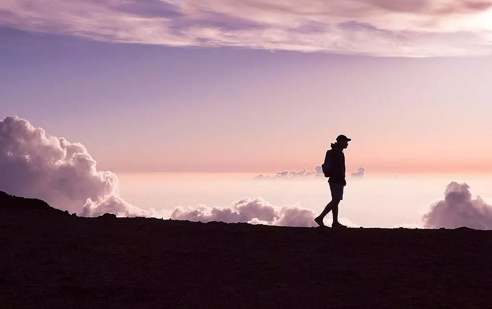
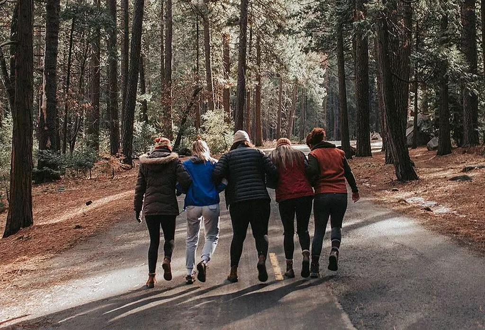

+++
date = '2021-06-11T17:36:24+03:30'
draft = false
title = 'چرا باید از همین امروز پیاده‌روی را شروع کنید؟'
description = 'بیاین درباره فواید پیاده روی برای روح و روان صحبت کنیم و ببینیم چطور این کار ساده می تونه کیفیت زندگی مون رو بهتر کنه.'
categories = ['health', 'lifestyle', 'personal-growth', 'productivity', 'tutorial']
keywords = ['پیاده‌روی', 'فواید پیاده‌روی', 'سلامت روان', 'سلامت جسم', 'تفکر', 'آرامش', 'انرژی', 'احساسات', 'دوستان', 'زندگی سالم', 'walking', 'benefits of walking', 'mental health', 'physical health', 'thinking', 'relaxation', 'energy', 'emotions', 'friends', 'healthy living']
tags = ['پیاده‌روی', 'فواید پیاده‌روی', 'سلامت روان', 'سلامت جسم', 'تفکر', 'آرامش', 'انرژی', 'احساسات', 'دوستان', 'زندگی سالم', 'walking', 'benefits of walking', 'mental health', 'physical health', 'thinking', 'relaxation', 'energy', 'emotions', 'friends', 'healthy living']
image = 'banner.webp'
+++

این نوشته در مورد آثار پیاده‌روی بر روی جسم نیست! قراره در مورد اثراتی که بر روی روح و روان ما می‌ذاره صحبت کنیم.

همه تقریبا از این موضوع که پیاده‌روی از لحاظ فیزیکی بسیار مفیده مطلع هستن. هرچی جلوتر می‌ریم هم تحقیقات بیشتری این مسئله رو تایید می‌کنن. من پزشک نیستم و از اصطلاحاتی که استفاده میشه سر در نمیارم پس سراغ این موارد نمیرم اما، در زندگی خودم تاثیرات بسیار زیادی داشته که قصد دارم با شما در میون بذارم.
# فرصتی برای اندیشیدن

امروزه ما با دنیایی از اطلاعات روبه‌رو هستیم. هر طرف که نگاه می‌کنیم یه چیزی پیدا میشه که حواس ما رو به خودش پرت کنه و وقت زیادی رو ازمون بگیره. یه جورایی بیش از حد به دنیای بیرون متصل شدیم. اینستاگرام، تلگرام و توییتر حالا قسمت بزرگی از روز ما رو تشکیل میدن. همه این‌ها باعث میشن که ما کمتر فکر کنیم. واقعا در طول روز چند دقیقه پیش میاد که شما سرتون خلوت باشه و به طور ارادی فکر آزاد داشته باشین؟

ما برنامه‌نویسا، زمانی که تو کدنویسی به باگ می‌خوریم و بعد تلاش زیاد نمی‌تونیم حلش کنیم به یه جای خاصی از خونه میریم. شاید تعجب کنین که این جای خاص دستشوییه. آره دستشویی. فکر نمی‌کنم مخصوص ما برنامه‌نویسا باشه و خیلیا برای اینکه فکرشون آزاد بشه به دستشویی میرن. خوشبختانه دستشویی تنها جاییه که هنوز تکنولوژی نتونسته بهش نفوذ داشته باشه و ما آزادیم. در واقع دستشویی نیست که باعث میشه ایده‌های نابی به ذهنمون بیاد، این خلوت کردن و فکر کردن آزاده که باعث این میشه.

وقتی داشتم توی ویرگول یه نوشته‌ای رو می‌خوندم، به یه نقل‌قولی برخوردم که می‌گفت:

> دیگه داریم هر کاری می‌کنیم که فکر نکنیم

در نگاه اول شاید غیر منطقی باشه ولی راست میگه. زندگی جوری شده که همه فکر می‌کنن هرکی سرش شلوغ‌تر باشه موفق‌تره. داریم مسیر اشتباهی رو پیش میریم.

بیاین یه تستی انجام بدیم تا ببینیم چقدر تلاش می‌کنیم که فکر نکنیم. از الان، به مدت ۵ دقیقه هیچ کاری انجام ندین. نه موسیقی گوش کنین، نه با کسی صحبت کنین و تمام تکنولوژی‌های موجود رو از جلوی چشماتون دور کنین. فقط ۵ دقیقه هیچ کاری نکنین!

بعد این تست لابد متوجه اوضاع میشین. یه چیزی از درونمون می‌خواد که مشغول انجام کاری باشه. ولی بعضی وقتا نیازه که هیچ کاری انجام ندین تا ذهنتون درگیر چیزی نباشه. انقدر آروم و بدون مشغله باشه که بتونه «فکر کنه». ایده‌های بزرگی به ذهن ممکنه بیاد ولی قبلش باید اونو از شر انجام کارهای کم اهمیت خلاص کنین. بذارین نفس بکشه یکم.

بعد این مقدمه بلند می‌رسیم به پیاده‌روی. پیاده‌روی فرصتی برای ما فراهم می‌کنه که از این غوغای جهان فارغ بشیم. نیم ساعت بیخیال همه‌چی بشیم و بریم بیرون. برای مدت محدودی هم که شده فکر نکنین که از بقیه عقب میفتین. هیچ‌کس با نیم ساعت پیاده‌روی عقب نمیفته و اخباری رو از دست نمیده. توی این مدت فقط فکرتون رو آزاد بذارین تا بتونه تا هرجایی که دلش می‌خواد پرواز کنه.

لازمه بگم که افراد بزرگی در تاریخ بودن که با همین پیاده‌روی تونستن آثار معروفی رو به جامعه تحویل بدن. افرادی مثل [Ernest Hemingway](https://www.goodreads.com/quotes/195789-i-would-walk-along-the-quais-when-i-had-finished) و [Charles Dickens](http://www.literaturepage.com/read/dickens-the-uncommercial-traveller-95.html). به قول فردریش نیچه:

> تمام افکار عالی با راه رفتن تصور می‌شوند.
# خالی کردن احساسات

زمانی می‌رسه که ما عصبانی میشیم. ناراحت و دلخور میشیم. دلمون تنگ کسی میشه و خیلی احساسات قوی دیگه. بالاخره این‌ها همه طبیعی هستن اما احساساتی مثل خشم خطرناکن. بهتره که در زمان خشم زیاد اون محیط رو ترک کنیم تا آروم بشیم. و چی بهتر از پیاده‌روی.

گروهی از اسکیموها هستن که وقتی ناراحت یا عصبانی میشن، از خونه می‌زنن بیرون و تا زمانی که عصبانیتشون رد نشده راه میرن. وقتی حالشون خوب شد یه چوب رو توی یخ فرو می‌کنن. این شکلی میتونن بفهمن چقدر عصبانی بودن. جالبه نه؟

حتما فیلم فارست گامپ رو دیدین(اگه ندیدین حتما پیشنهاد می‌کنم که ببینین). فارست بعد درد و رنج سنگینی که دچارش شد تصمیم گرفت بره بدوه و این کار رو چند سال ادامه داد تا تونست اون اتفاقات رو فراموش کنه! فارست میگه:

> قبل از ادامه کار باید گذشته را پشت سر بگذارید.
# گرفتن انرژی
موقع پیاده‌روی مشخصه که سطح انرژی بدن میاد پایین. ولی سطح انرژی روحی روانی میره بالا، عجیب هم میره بالا. تا حالا شده توی این دوران کرونایی که همیشه تو خونه بودیم از وضع موجود گلایه داشته باشین و دلتون از همه‌چی گرفته باشه؟ خسته شده باشین از همه‌چی. من که چند باری به این وضع دچار شدم و همیشه یه پیاده‌روی تونسته دوای دردم باشه. بیرون زدن از خونه می‌تونه دوای درد مشکلات زیادی باشه.

دیدم خیلی‌ها رو که برای خوشحال شدن باید کارهای خیلی بزرگی انجام بدن. زندگی کردن اون‌قدرها هم سخت نیست. هرچی بیشتر سخت بگیری زندگی سخت‌تر میشه. زندگی واقعی یعنی احساس خوشبختی و خوشحالی با وجود تمام نواقصی که توی دنیا هست. با یه پیاده‌روی و گشت زدن توی شهر با جاهای خیلی قشنگی مواجه میشین. کوچه‌ها و خیابونایی رو پیدا می‌کنین که خیلی جذابن. حتی ممکنه با دیدن محله دوران بچگی کلی خاطره بیاد جلوی چشماتون.

تازه با یه دوپینگ میشه تجربه خیلی بهتری از پیاده‌روی داشته باشین و اون همراهی کردن با دوستاست. به نظرم هیچی بهتر از این نیست که با کسی که دوسِش داری بری پیاده‌روی. دوستان خوب باارزش‌ترین موجودات روی زمینن اگه دارین قدرشونو بدونین.
# سخن پایانی
پیاده‌روی از آسون‌ترین کارهاییه که میشه انجام داد و غیر از یه جفت کفش خوب به چیزی نیاز نداره. نه استعداد و مهارتی نیاز داره نه ابزار و وسایل و هزینه خاصی. برای سلامت جسم و جان هم مفیده و لذت بخشه. پس بهتره که از همین امروز پیاده‌روی رو شروع کنید.