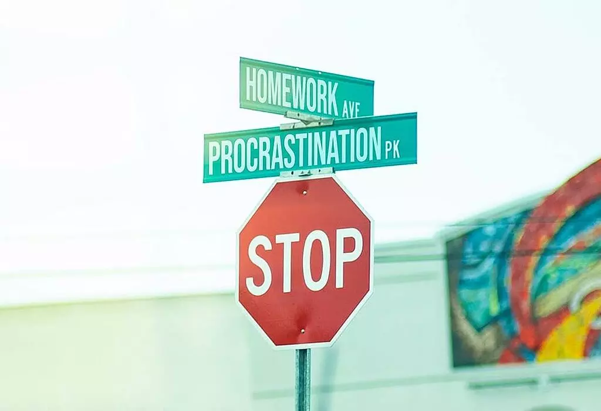
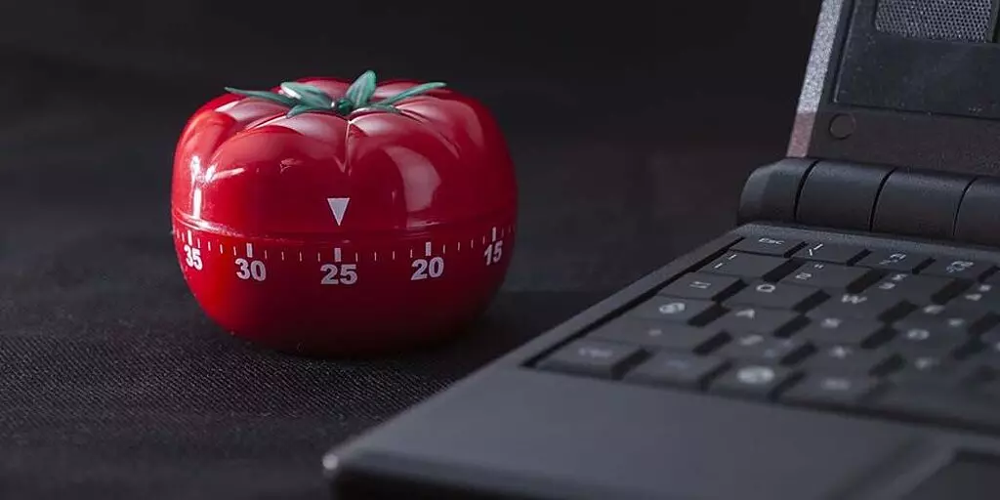

+++
date = '2021-05-28T22:10:30+03:30'
draft = false
title = 'چرا در انجام کارهایمان تعلل می کنیم؟'
description = 'دو سوال اساسی برای از بین بردن Procrastination یا دست‌دست کردن'
categories = ['personal-growth', 'productivity', 'tutorial']
keywords = ['تعلل', 'Procrastination', 'چرا تعلل می‌کنیم', 'راه‌های جلوگیری از تعلل', 'افزایش بهره‌وری', 'مدیریت زمان', 'تکنیک پومودورو', 'لیست کارها', 'عادت‌های خوب', 'توسعه فردی', 'productivity', 'time management', 'pomodoro technique', 'good habits', 'personal growth']
tags = ['تعلل', 'Procrastination', 'چرا تعلل می‌کنیم', 'راه‌های جلوگیری از تعلل', 'افزایش بهره‌وری', 'مدیریت زمان', 'تکنیک پومودورو', 'لیست کارها', 'عادت‌های خوب', 'توسعه فردی', 'productivity', 'time management', 'pomodoro technique', 'good habits', 'personal growth']
image = 'banner.webp'
+++

تعلل در کارها یا Procrastination برای چی اتفاق میفته؟ چرا با این‌که می‌دونیم گشتن تو فضای مجازی و به خصوص اینستاگرام فایده‌ای برامون نداره، با این حال سراغ کارهامون نمی‌ریم؟ در این نوشته قراره با هم بررسی کنیم که چرا این اتفاق میفته و چطوری میشه ازش جلوگیری کنیم.
# چرا تعلل در انجام کارها اتفاق میفته؟
تعلل و دست دست کردن در انجام کارها، یعنی این‌که به جای انجام یک کار مهم و ضروری، کار دیگه‌ای رو انجام بدیم و اون کار رو موکول کنیم به یک زمان دیگه. مثلا زمانی که دانش‌آموزی درس‌خوندن برای امتحان رو می‌ذاره برای آخرین لحظات داره تعلل می‌کنه.

همه با این حس و حال مواجه شدیم. توی این شرایط با این که میدونیم باید کاری رو انجام بدیم ولی بعد از چند ساعت وقت تلف کردن پشت گوشی، به خودمون میایم و حسرت زمان از دست رفته رو می‌خوریم.

این روزا این حس که وقتمون داره تلف میشه شایع شده. مخصوصا بعد از شیوع کرونا که زمان زیادی رو در خونه هستیم. چرا تعلل داره فراگیر میشه و خیلی‌ها نمی‌تونن رفعش کنن؟ یکی از دلایلش اینه که نگرش نادرستی نسبت به این موضوع وجود داره.

معمولا دو دلیل برای افرادی که در انجام کاری تعلل می‌کنن آورده میشه:

1. اون فرد خیلی تنبله
2. اون فرد استعداد و توانایی انجام اون کار رو نداره

این دو دلیل باعث میشه فرد سرخورده بشه، احساس پوچی کنه و دیگه ادامه نده. این‌ها معمولا دلایل اشتباهی هستن. شخصی رو در نظر بگیرین که در طول ترم اصلا درس نخونده. وقتی نزدیک امتحانات میشه نگران میشه و با انگیزه و توان خیلی بالایی در مدت زمان محدود درس رو می‌خونه و معمولا نمره قابل قبولی هم می‌گیره. این نشون‌دهنده اینه که نه فرد تنبلی هست، و نه استعدادش کمه.

پس دلیل این همه امروز و فردا کردن چیه؟ دو دلیل برای این قضیه وجود داره:

1. اون فرد نمی‌دونه باید چه کاری انجام بده
2. اون فرد دلیل قانع‌کننده‌ای برای انجام کارش نداره

واقعا کل قضیه به همین دو دلیل خلاصه میشه. لطفا به تعلل دید منفی نداشته باشین. تعلل کردن در کارها یک هشدار از سمت مغز ماست. هشداری که داره میگه واقعا برای چی دارم این کارها رو انجام میدم؟ آیا واقعا به کارم میان؟ اصلا این کارها ارزش این رو دارن که وقت با ارزشم رو براشون صرف کنم؟ آیا بهتر نیست سطح خودم رو کمی بالاتر ببرم و کارهای بهتری رو به جای این کارها انجام بدم؟

در واقع هنگام تعلل، قسمتی از ما نسبت به کاری که داریم انجام میدیم شاکی میشه. اون قسمت از ما، برنامه فعلی رو قبول نداره و به دنبال اهداف والاتری هست. پس بهش گوش بدین. سرکوبش نکنین و انگ تنبلی به خودتون نزنین.

وقتی برای انجام کاری طفره میریم که در اون کار شک و تردید داشته باشیم. اون کار مبهم باشه و از مفید بودن اون مطمئن نباشیم. تعلل باعث میشه از بالا نگاهی به کاری که انجام میدیم داشته باشیم تا مطمئن بشیم در راستای اهدافی هست که برای خودمون تعیین کردیم.
# چطور از تعلل جلوگیری کنیم؟

دو سوال اساسی وجود داره که با پاسخ به این سوالات میشه جلوی تعلل در کارها رو گرفت:

1. چه کاری باید انجام بدم؟
2. چرا باید چنین کاری رو انجام بدم؟

اتکا به انگیزه کار درستی نیست، چرا که همیشه انگیزه نداریم. اما انگیزه سلاح بسیار قوی برای پیشبرد اهدافمون هست. خوبی انگیزه اینه که میشه اون رو افزایش داد. شاید ذهنتون رفته باشه پیش متن‌ها و فیلم‌های انگیزشی که توی یوتیوب هزاران و شاید میلیون‌ها بازدید داشتن. اما باید بگم نه، این چیزها انگیزه ما رو به شکل بلندمدت بالا نمی‌برن بلکه پاسخ دادن به این دو پرسش هست که ما رو باانگیزه می‌کنه.

به این دو پرسش به طور خیلی دقیق و جزئی پاسخ بدین. هرچی به شکل کلی‌تر جواب بدین تاثیر کمتری روی شما میذاره. برای مثال بگین من باید دوره آموزشی CryptoCurrency رو از سایت Coursera ببینم چون می‌خوام ۲ ماه بعد در بازار رمزارزها سرمایه‌گذاری کنم و سود ببرم.

اگر پاسخ دادن به این پرسش‌ها برای شما مقدور نیست، ممکنه نشونه این باشه که اصلا نیازی به انجام اون کار ندارین! در این موارد دست از انجام دادن کار بکشین و رهاش کنین. یکی از بدترین استفاده‌های از زمان اینه که کاری رو به بهترین نحو انجام بدیم در حالی که اصلا نیازی به انجام دادنش نیست.

حتی ممکنه کاری که انجام میدیم در نظر همه کار درستی باشه، ولی ته دلمون مطمئن باشیم که واقعا این کار برای من ساخته نشده. رفتن به دانشگاه و تحصیلات در مقاطع بالا یکی از این موارده که در نظر اکثر مردم کار بسیار پسندیده و خوبیه، در حالی که شما افراد بسیار موفقی رو میبینین که دانشگاه نرفتن یا اینکه دانشگاه رو رها کردن.
# ابزارهایی که ما را در این راه کمک می‌کنند
## اندازه گیری

زمانی که صرف انجام کارهای مختلف می‌کنین رو ثبت کنین. بعد از مدتی با دیدن این حجم از زمان از دست رفته، خودبه‌خود از وضع موجود شاکی میشین و انگیزه بالایی برای استفاده بهتر از زمانتون به‌دست میارین. برنامه‌هایی مثل [YourHour](https://yourhour.app/) در اندروید و [RescueTime](https://www.rescuetime.com/) در ویندوز مثال‌هایی هستن که به ما در این زمینه کمک می‌کنن.
## تایمر pomodoro

پومودورو یک سیستم زمان‌بندی برای کارکردن هست. در این سیستم، شما بعد از هر ۲۵ دقیقه کار کردن مقدار کمی(مثلا ۵ دقیقه) استراحت می‌کنین. بعد از چهار دور از انجام این کار، مقدار بیشتری(مثلا ۱۵ دقیقه) استراحت می‌کنین. خوبی این سیستم اینه که میشه روز رو به بلاک‌های ۲۵ دقیقه‌ای تقسیم کرد. برای مثال ۴ بلاک رو درس خوند و ۳ بلاک رو فیلم دید. علاوه بر اون با استراحت‌هایی که در خودش داره باعث میشه کم نیارین و حداکثر استفاده از سطح انرژیتون رو ببرین.
## دور انداختن todo-list

تودولیست‌ به اندازه خودش کمک زیادی به ما می‌کنه. اما باید توجه کنیم که اولویت در این لیست‌ها وجود نداره. به جای todo-list از روش ABCDE استفاده کنین. در این روش به کارهای مختلف اولویت داده میشه و کارهای با اولویت بالاتر باید زودتر انجام بشن.

* به کاری که حتما حتما باید انجام بشه برچسب A بزنین.
* به کاری که باید انجام بشه ولی اگه انجام نشه دنیا به آخر نمی‌رسه برچسب B بزنین.
* به کاری که انجام دادنش خوبه، ولی ارزش زیادی به شما اضافه نمی‌کنه(مثل چک کردن ایمیل) برچسب C بزنین.
* به کاری که میشه به بعد موکول کرد برچسب D و به کاری که میشه حذفش کرد برچسب E بزنین.

همیشه کارها رو از A شروع کنین به انجام دادن و به سمت کارهای با اولویت کمتر برین. به قول کتاب قورباغه‌ات را قورت بده:

> اگه به عنوان صبحانه، یک قورباغه زنده، زشت و گنده رو بخورین، دیگه خیالتون راحته که در طول روز هیچ چیزی بدتر از اون نمی‌تونه اتفاق بیفته. پس اول از همه قورباغه‌ات را قورت بده.
## کاری که مهارت دارین رو انجام بدین
اگه با انجام کاری، بازخورد خوبی از بقیه می‌گیرین، همون کار رو انجام بدین. برای مثال اگه مردم عاشق نوشته‌های شما هستن، به نوشتن ادامه بدین. حتی اگه نوشتن اولویت اصلی شما نباشه، حمایتی که از سمت مردم روانه شما میشه ممکنه باعث علاقه بیشتر شما به این کار بشه.
## عادت‌های خوبی در خود ایجاد کنید
اکثر کارهایی که در طول روز انجام میدیم، برگرفته از عادت‌های ما هستن. خیلی از مواقع اصلا بدون فکر کردن کاری رو انجام میدیم. تا می‌تونین عادت‌های خوبی در خودتون ایجاد کنین و عادت‌های بد رو از خودتون دور کنین.
## خودتون رو مجبور کنین
بعضی وقت‌ها هم هست که باید کاری رو انجام بدین، هرچند حس و حال انجامش رو ندارین. در این مواقع میشه از اجبار کمک گرفت. آدم‌های بزرگی از این روش برای پیش‌بردن کارهاشون استفاده کردن. برای مثلا ویکتور هوگو تمام لباس‌هاش رو به خدمتکارش داد و بهش دستور داد تا زمانی که نوشتن کتابش تموم نشده لباس‌هاش رو بهش برنگردونه. این شکلی خودش رو مجبور کرد تا نوشتن رمانش رو زودتر به پایان برسونه.
# سخن پایانی
تعلل در انجام کارها، برخلاف دید منفی که نسبت بهش وجود داره، نوعی هشدار از طرف مغز هست برای این‌‌که وقت و انرژیمون رو هدر ندیم. همین الان چند ساعتی رو وقت بذارین تا کارهایی رو که واقعا دوست دارین انجام بدین پیدا کنین و راه و روشی مشخص برای رسیدن به اون جایگاه تعیین کنین. موفق باشین!